# Kanzasset ↔ AMR · Akışlar

**21 Eylül 2026 · v2** · Rafineri (Ahlatcı Metal Refinery, AMR) ile Kanzasset (KZ) arasında her gün çalışacak akışlar: fiyat, bakiye bilgisi, alım satım, kasa talimatları, fiziksel teslimat, rafinasyon, mahsuplaşma. Her akış bir şema + defter etkisi + red yolu ile verilir. İş kuralları kaynağı: `KANZASSET_FZCO_How_the_business_works` (21 Eyl).

**Aktörler:** Müşteri · **KZ Çekirdek** (Kanzasset platformu ve hazinesi) · **AMR uygulaması** (rafineri tarafında çalışan, KZ'ye API veren uygulama) · Merkezi uygulama (rafinerinin fiyat kaynağı) · BitGo (hazine cüzdanı, müşteri omnibus cüzdanı, burn cüzdanı; yalnız KZ tarafında) · Banka (Kanzasset şirket hesabı ve müşteri hesabı; USD / EUR / AED alt hesaplar) · Likidite sağlayıcı (USDT / USDC ↔ USD).

**Rafineri ile aramızdaki talep tipleri:** **emir** (alış / satış) · **kasa talimatı** (giriş / çıkış) · **fiziksel teslimat** · **rafinasyon** · **mahsuplaşma**. Her talebin durumları vardır; her durum değişikliği iki tarafta da bildirim üretir.

**Rafineride iki hesap (Kanzasset FZCO adına):**

- **V · Kasa Hesabı:** kasaya konmuş, bizim adımıza ayrılmış gram. Tokenleri 1:1 karşılar. Yalnız bizim talimatımızla hareket eder: **kasa talimatı** giriş (05) / çıkış (06), **fiziksel teslimat** (10) ve **rafinasyon** (11). Alt kalemler: `kasada` (yerleşti) · `kasaya konuluyor` (kabul edildi, henüz konulmadı; en geç T+3) · `sevkiyatta` (kasadan çıktı, henüz teslim edilmedi; hâlâ bizim, arz değişmez).
- **T · Cari Hesap:** gün içinde rafineriyle yaptığımız alım satımların henüz kapanmamış hesabı, tedarikçi cari hesabı gibi. İki yüzü var: **altın** (`T`, gram, işaretli: artı = aldık, henüz kasaya konmadı; eksi = sattık, henüz kasadan çıkmadı) ve **para** (`P`, kur bazında, işaretli: eksi = Kanzasset borçlu, artı = rafineri borçlu; alış satış bedelleri + hizmet bedelleri). Mahsuplaşmada kapanır (12).

**Semboller:** `V` kasa hesabı · `T` cari hesap altın (işaretli) · `P[kur]` cari hesap para · `A` arz (mint − burn) · `S` hazine token stoku · `C` müşteri elindeki AGOLD · `E` emanet (teslimat ve rafinasyon için burn cüzdanında bekleyen, henüz yakılmamış) · `K` envanter hedefi = 20.000 g · `A = S + C + E`.

**Kurallar (her akışta korunur):**

- **K1** `A ≤ V`; dinlenme hâlinde `A = V`. Fark yalnız geçiş anında olur: kasa girişi kabul edildi, mint henüz yapılmadı; ya da burn yapıldı, kasa çıkışı henüz kabul edilmedi. V hiçbir an A'nın altına inmez: mint fişten **sonra**, kasa çıkışı talebi burn'den **sonra**.
- **K2** `S + T = K` sabit. Her müşteri emri aynı gramla rafineride eşlenir; pozisyon taşımayız. Mahsuplaşma T'yi V'ye taşır ve S hedefe döner; toplam değişmez. `K` yalnız hazine alım satımıyla değişir (09).
- **K3** Cari hesap limiti: `|T|` ve her kurda `|P|` limiti aşamaz. Limitte mahsuplaşma çağrılır ya da işlem durur. Limit ayarlardan girilir, iki yönlüdür.
- **K4** Mint dayanağı **Kasa Giriş Fişi** (rafinerinin kabulü: gramlar kasa hesabında Kanzasset FZCO adına). Kasaya koyma en geç T+3'te "kasaya konuldu" durumuyla kapanır. Burn, kasa çıkışı talebinden **önce**.
- **K5** Rafineriye ödeme yalnız **şirket banka hesabından**, işlemin kurunda; müşteri hesabı asla ödemez.

**Rafineri tarafında olmayan kavramlar:** mint, burn, token, cüzdan, müşteri adı. Rafineri gram, fiş, fiyat ve para görür; talepler yalnız "gram + Kanzasset referans numarası" taşır.

---

## 01 · Fiyat yayını

Fiyat rafinerinin **merkezi uygulamasından** gelir. AMR uygulamasında merkez bağlantısı kurulur (soket adresi ve kimlik girilir, Bağlan denir); fiyat akmaya başlayınca AMR uygulaması bunu KZ'ye **soketle** (WebSocket, kalıcı bağlantı) yayınlar. Merkez bağlantısı yoksa yayın yoktur, yayın yoksa işlem yoktur. Gram başına, 999,9 ayar için **çift yönlü** fiyat (bid ve ask bağımsız), **USD · EUR · AED**, **boyuttan bağımsız**: kademe yok, aynı fiyat her miktara. Ask müşteri alışında bizim maliyetimiz, bid müşteri satışında bizim aldığımızdır.

**Nasıl çalışır:**

1. Rafineri, AMR uygulamasında merkez bağlantısını kurar; fiyat gelmeye başlar, yayın açılır.
2. KZ `wss://…/v1/prices` adresine bağlanır ve abone olur.
3. AMR önce **anlık fotoğraf** (üç kurda güncel fiyat) gönderir, sonra fiyat **değiştikçe** tick yayınlar (saniyede en fazla ~1).
4. Her tick'te **`seq`** (artan sayaç), **`ts`**, üç kur için bid/ask ve **`tradable`** bayrağı vardır.
5. 5 saniye tick yoksa AMR **heartbeat** gönderir. **10 saniye** hiçbir mesaj gelmezse fiyat bayattır: müşteri tarafı durur.
6. Rafineri yayını elle durdurabilir (Durdur / Başlat). `tradable=false` → müşteri tarafı durur.
7. `seq` atlarsa KZ yeniden abone olur ve fotoğrafı ister.
8. KZ her emirde kullandığı tick'in `seq` değerini (**`quote_seq`**) ve slippage limitini emirle gönderir; rafineri fill fiyatını buna göre verir ya da reddeder.

```json
{ "type": "tick",
  "seq": 48211,
  "ts": "2026-09-21T09:15:02.120Z",
  "tradable": true,
  "prices": [
    { "ccy": "USD", "bid": 141.80, "ask": 142.00 },
    { "ccy": "EUR", "bid": 130.27, "ask": 130.45 },
    { "ccy": "AED", "bid": 520.79, "ask": 521.52 }
  ] }

{ "type": "heartbeat",
  "seq": 48211,
  "ts": "2026-09-21T09:15:07.000Z",
  "tradable": true }
```

<!-- cap: Fiyat zinciri -->
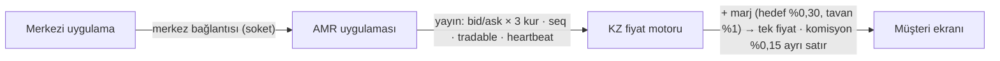

<!-- cap: Abonelik ve yayın döngüsü -->
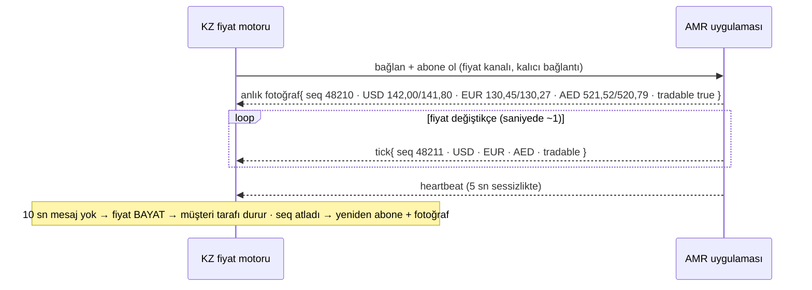

**Defter:** fiyat defteri etkilemez · müşteriye tek fiyat (marj gömülü) + komisyon ayrı satır · rafineri fiyatı müşteriye gösterilmez

---

## 02 · Bakiye bilgisi

Metal hareketi doğuran her cevapta (fill, kasa talimatı kabulü, sevkiyat ve teslimat adımları) AMR uygulaması **iki hesabı birden** döner; KZ istediği an `GET /v1/account` ile anlık fotoğraf da alır. Bu anlık doğrulamadır; mahsuplaşmanın yerine geçmez.

```json
"account": {
  "seq": 18452,
  "vault": {
    "in_vault_mg": 20000000,
    "placing_mg": 0,
    "shipping_mg": 0
  },
  "current_account": {
    "gold_mg": 947640,
    "money": [
      { "ccy": "USD", "cents": -13456488 },
      { "ccy": "EUR", "cents": 0 },
      { "ccy": "AED", "cents": 0 }
    ]
  }
}
```

`vault` toplamı `V`'dir (kasada · kasaya konuluyor · sevkiyatta). `current_account.gold_mg` = `T` (artı: aldık, henüz kasaya konmadı; eksi: sattık, henüz kasadan çıkmadı). `current_account.money[]` = `P` (eksi: Kanzasset borçlu, artı: rafineri borçlu). Birimler mg ve cent, tam sayı. `seq` hesap hareket numarasıdır, fiyat `seq`'inden ayrıdır.

**Kural:** KZ her hareketi kendi kaydına işler → **KZ kaydı**, rafineriden gelen bakiye bilgisine **birebir eşit olmalı**. Eşit değilse: hareket geçerli kalır (fiyat bağlayıcı), hesap `RECONCILE` durumuna düşer, iki tarafa bildirim, KZ tarafında **mint ve kasa çıkışı talebi bloke**, çözülene kadar. `seq` atlarsa anlık fotoğraf istenir.

<!-- cap: Eşleşme kuralı · her harekette doğrulama -->
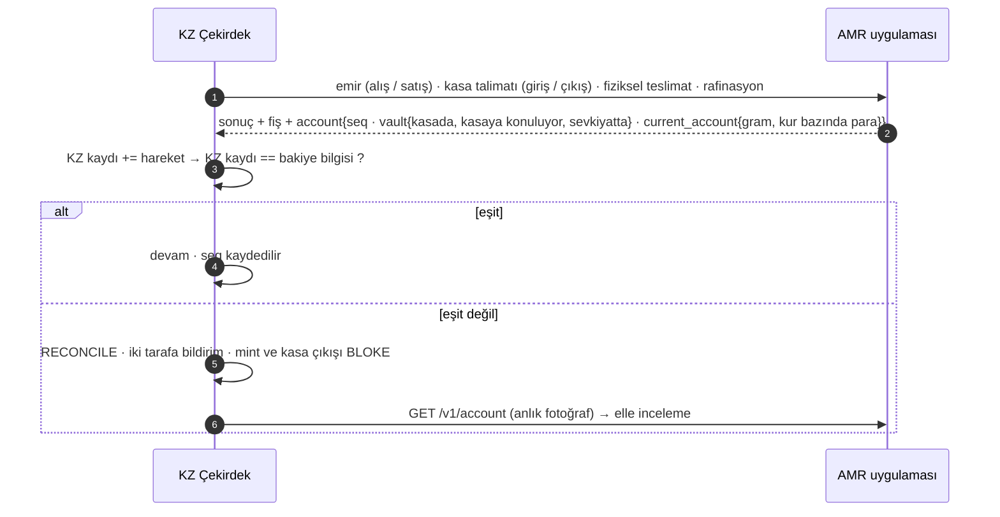

**Defter:** hareket geçerli kalır · `seq` atlarsa fotoğraf istenir · uyuşmazlıkta mint ve kasa çıkışı durur · mahsuplaşma takvimi değişmez

---

## 03 · Stoktan alış

Müşteri AGOLD alır, teslim hazine stokundan yapılır. Sıra sabit: **bloke → rafineride alış emri → teslim → tahsilat.** Rafineri emri müşteri miktarıyla birebir (0,001 g). Bu akışta mint yok; stok tabanın altına inecekse 07 çalışır. Para bacağı ödeme aracına göre iki türlü.

<!-- cap: 03a · İtibari para ile (USD / EUR / AED) -->
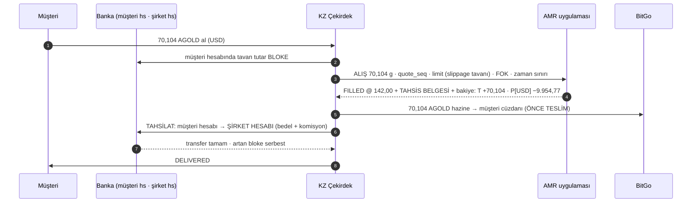

**Defter:** S −70,104 · T +70,104 → **S + T = K ✓** · C +70,104 · V ve A değişmez · P[USD] −9.954,77 (Kanzasset borçlu) · para: müşteri hs → şirket hs

<!-- cap: 03b · USDT / USDC ile · dönüşüm bacağı likidite sağlayıcıda -->
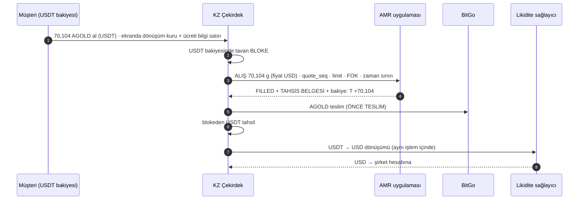

**Defter:** rafineriye **her zaman fiat** ödenir · dönüşüm ücreti (~%0,1) bilgi satırı · gram tarafı 03a ile aynı

**Red:** fill slippage tavanını aşarsa `REJECTED` → bloke çözülür, müşteriye iptal. **Cevapsız:** bkz. Durum · Cevapsız emir; teslim yok. Rafineriye ödeme bu akışta yok: mahsuplaşmada (12).

---

## 04 · Stoktan satış

Müşteri AGOLD satar, tokenler hazine stokuna döner. Sıra: **AGOLD bloke → rafineride satış emri → önce ödeme → token stoğa.** `T` eksiye inebilir; gramlar kasadan mahsuplaşmada çıkarılır (12). Stok tavanı aşılırsa 08 çalışır. Tek sınır cari hesap limiti (K3).

<!-- cap: 04a · Ödeme itibari para ile · şirket hesabından müşteri hesabına -->
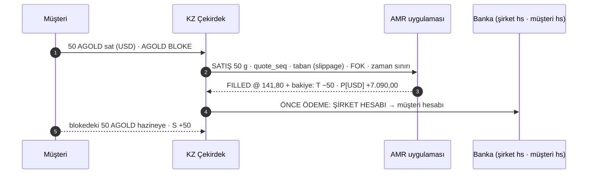

**Defter:** S +50 · T −50 → **S + T = K ✓** · C −50 · V ve A değişmez · P[USD] +7.090,00 (rafineri borçlu) · para: şirket hs → müşteri hs

<!-- cap: 04b · Ödeme USDT / USDC ile -->
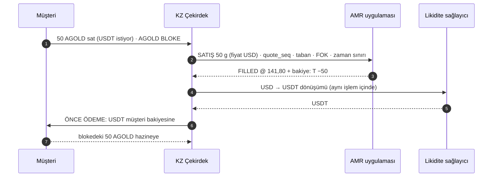

**Defter:** dönüşüm kuru + ücreti bilgi satırı · gram tarafı 04a ile aynı

**Red:** fill slippage tabanının altında kalırsa `REJECTED` → bloke çözülür. **Cevapsız:** bkz. Durum · Cevapsız emir; ödeme yok. Rafineriden alacak mahsuplaşmada kur bazında netleşir (12).

---

## 05 · Kasa girişi

Kasa hesabına gram girişi yalnız bu taleple olur. KZ talebi gönderir (gram + referans) → rafineri **Kabul et** der (ayarlarda otomatik kabul açılabilir; hedef cevap süresi parametre) → o anda **Kasa Giriş Fişi** oluşur ve KZ'ye gider; gram cari hesaptan kasa hesabına geçer (`T −q`, `kasaya konuluyor +q`) → rafineri durumu **Kasaya konuluyor** yapar → külçe yerleşince **Kasaya konuldu** (en geç T+3; `kasaya konuluyor → kasada`). KZ tarafında fiş gelince mint yapılır (`A +q`, `S +q`); bu adım rafineriye görünmez.

Kim tetikler: **07** (büyük alış, stok yetmezse) · **09** (hazine alımı) · **12** (mahsuplaşma, net alış). Miktar 0,001 g hassasiyetinde. Red: rafineri talebi reddedebilir (gerekçeyle); gram cari hesapta kalır, KZ bildirim alır.

<!-- cap: Kasa girişi · talep → kabul (fiş) → kasaya konuluyor → kasaya konuldu -->
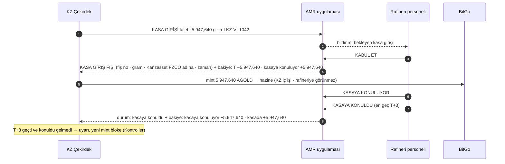

**Defter:** T −q · V +q (önce kasaya konuluyor, sonra kasada) · A +q · S +q → **S + T = K ✓** · **A ≤ V ✓** (fiş önce, mint sonra) · fiyat yok: gramlar emirlerde zaten alındı

---

## 06 · Kasa çıkışı

Kasa hesabından gram çıkışı (teslimat ve rafinasyon dışında) yalnız bu taleple olur. KZ **önce** kendi tarafında burn yapar (rafineriye görünmez) → talebi gönderir (gram + referans) → rafineri **Kabul et** der → **Kasa Çıkış Fişi** oluşur; gram kasa hesabından cari hesaba geçer (`kasada −b`, `T +b`). Burn önce olduğu için `A ≤ V` hiç bozulmaz. Kasa çıkışı fiyatsız işlemdir: fiyat `T`'deki satış fill'lerinde zaten kilitli.

Kim tetikler: **08** (büyük satış, stok tavanı aşarsa) · **09** (hazine satışı) · **12** (mahsuplaşma, net satış) · AED itfası (müşterinin emanet tokenleri `E` için: satış emri → müşteriye ödeme → burn → kasa çıkışı).

<!-- cap: Kasa çıkışı · burn (KZ) → talep → kabul (fiş) -->
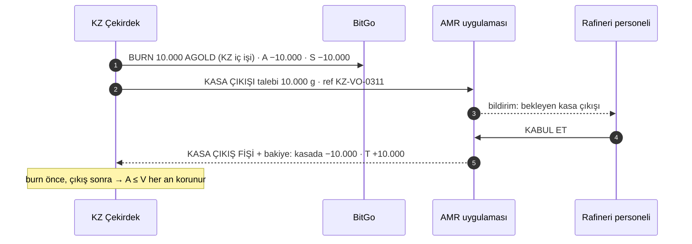

**Defter:** A −b · S −b · V −b · T +b → **S + T = K ✓ · A ≤ V ✓** · fiyatsız işlem

---

## 07 · Büyük alış (stok yetmezse)

Emir `x`, teslim sonrası `S − x < taban (10.000)` olacaksa: bloke → **alış emri x** (fiyat kilidi, `T +x`) → **kasa girişi p** (05, rafineri kabulü beklenir) → mint `p` → **tek seferde teslim x** → tahsilat. `p` = eksik kısım = `x − (S − taban)`; parametre `mint_policy = SHORTFALL` (varsayılan) ya da `FULL_ORDER` (emrin tamamı). Kısmi teslim yok. Müşteriye emir anında: fiyat kilitlendi, teslim hazırlanıyor (ETA rafineri kabul süresine göre) ve ifşa: "emriniz yeni ihraçla karşılandı".

<!-- cap: Örnek · S = 19.052,360 · emir 15.000 · eksik 5.947,640 -->
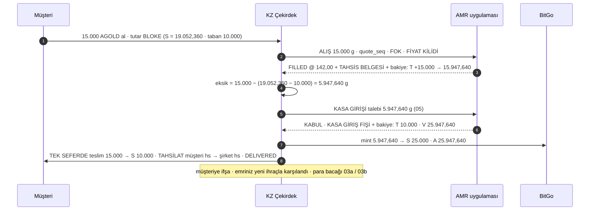

**Defter:** S 19.052,360 → 10.000 · T 947,640 → 10.000 → **S + T = 20.000 ✓** · V = A = 25.947,640 ✓ · fiyat riski 0 (ilk saniyede kilitli) · bekleyen tek şey rafineri kabulü ve operasyon süresi

---

## 08 · Büyük satış (stok tavanı aşarsa)

Satış sonrası `S > tavan (21.000)` olacaksa: AGOLD bloke → **satış emri x** (fiyat kilidi, `T −x`) → **önce ödeme** → token stoğa → **burn fazla** (KZ) → **kasa çıkışı** talebi (06). Fazla = `S − hedef` (parametre). Kısmi işlem yok; fiyat fill anında kilitli.

<!-- cap: Örnek · S = 20.000 · satış 10.000 · fazla 10.000 -->
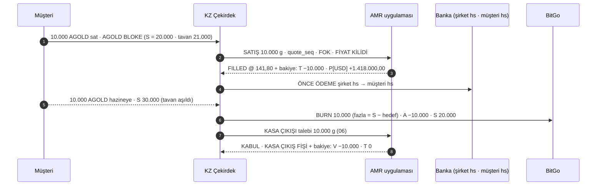

**Defter:** A −10.000 · S −10.000 · V −10.000 · T +10.000 → **S + T = K ✓ · A ≤ V ✓** · bedel mahsuplaşmada rafineri borcu (P[USD] +1.418.000,00)

**Not:** Müşteri emri ile kasa çıkışı kabulü arasındaki pencerede defterde "kasa çıkışı bekleyen: 10.000 g" kalemi durur; fiyat riski yok.

---

## 09 · Hazine alımı ve satışı (envanter hedefi)

Hazine, müşteri emrinden bağımsız olarak envanter hedefini (`K`) değiştirmek için rafineriyle kendi alım satımını yapar. Maker-checker; **son onaycı canlı fiyatla gönderir** (gönderim anındaki fiyat bağlayıcı). Alım sermayeden ödenir; müşteri parası asla. Satımda yalnız hazine stokundaki tokenler yakılır; müşteri tokenlerine dokunulmaz.

- **Alım** (açılış ve hedef artışı): alış emri → kasa girişi (05) → mint. Açılış günü: 20 kg alınır, kasaya girer, 20.000 AGOLD mint edilir → `S = K = 20.000`, `T = 0`, `V = A = 20.000`.
- **Satım** (hedef azaltma): satış emri (fiyat kilidi) → burn → kasa çıkışı (06). Bedel mahsuplaşmada rafineri borcu; `K` satılan kadar düşer.

<!-- cap: Alım · açılış 20 kg -->
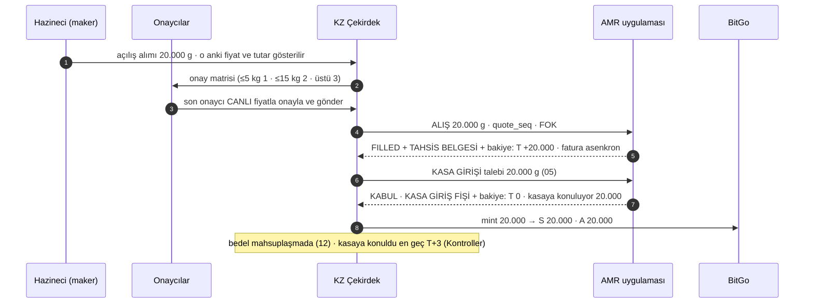

**Defter (alım):** T +q → 0 · V +q · A +q · S +q · K +q

<!-- cap: Satım · hedef 20.000 → 15.000 -->
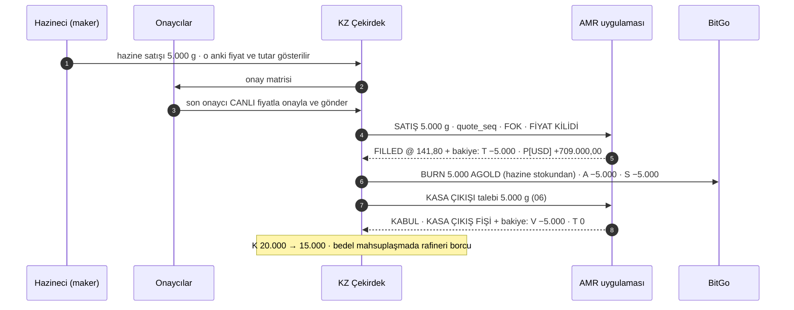

**Defter (satım):** T −b → 0 · V −b · A −b · S −b · K −b → **A ≤ V ✓** (burn önce, çıkış sonra)

---

## 10 · Fiziksel teslimat

Müşteri tokenlerine karşılık standart külçe ister (itfa). Kanzasset komisyon ve marj almaz; yalnız **lojistik masrafı** vardır, müşteriden aynen alınır ve rafineriye ödenir. Rafineri lojistiği anlaşmalı taşıyıcısıyla kurar (yalnız Kanzasset ile sözleşmeli, müşteriyle değil); taşıma sigortasının lehtarı müşteri. Müşteriye karşı kurallar (eşik, ücretsizlik, burn anı) iş dokümanındadır; rafineri akışını değiştirmez.

**Adımlar:** KZ talep gönderir (gram · standart külçe · adres referansı) → rafineri taşıyıcıdan **lojistik fiyatı** alır ve girer → KZ (müşteri onayından sonra) **onaylar**; masraf cari hesabın para tarafına kalem olur → rafineri **hazırlar** → hazır olunca **Sevkiyat Fişi** kesilir, külçe kasadan sevkiyat alanına (`kasada −x`, `sevkiyatta +x`) → taşıyıcı alır, **takip numarası** girilir → **teslim edildi** (teslimat kaydı; `sevkiyatta −x`; KZ aynı anda burn) · iptal (sevkiyattan önce; külçe kasaya döner).

<!-- cap: Durum makinesi · AMR tarafı · kasa hesabı etkisi -->
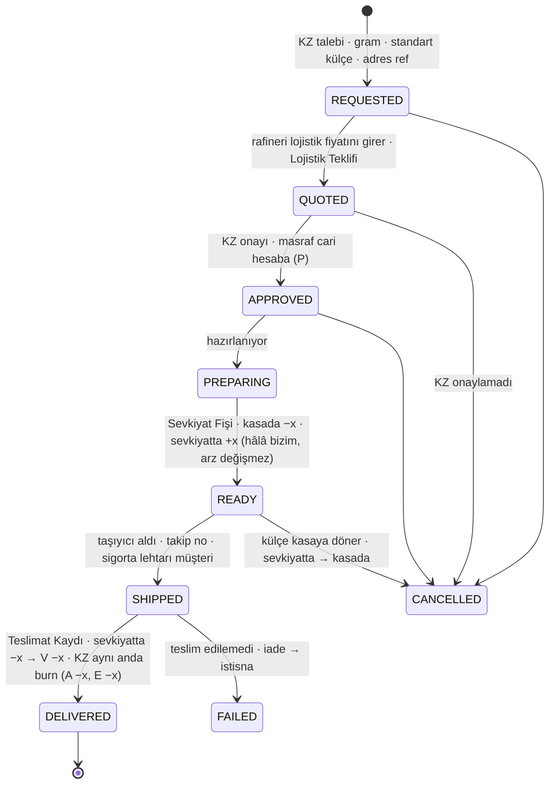

**Defter:** talep anında token → burn cüzdanı (`E +x`, `C −x`, yakılmadı) · APPROVED: `P[kur] −lojistik` (Kanzasset borçlu) · READY: `V` toplamı değişmez, alt kalem değişir · DELIVERED: `V −x` ve `A −x` aynı anda → **K1 ✓** · lojistik bedeli mahsuplaşmada netleşir, müşteriden aynen alınmıştır

**Not:** Takip numarası girildikten sonra teslimat taşıyıcının sisteminden izlenir; "teslim edildi" rafineri personeli tarafından işlenir (ileride taşıyıcı entegrasyonuyla otomatik). Rafineri ekranı müşteri adı görmez; yalnız "Kanzasset FZCO" ve adres referansı.

---

## 11 · Rafinasyon

Müşteri tokenlerine karşılık **istediği gramajda ürün** ister (1 g'dan itibaren, katalogdaki ürünler). Rafineri **ürün kataloğunu** (ürün · gramaj · ayar · tarife · üretim süresi) AMR uygulamasında tutar; KZ kataloğu çeker ve müşteriye seçim sunar. Kanzasset marj ve komisyon alır (müşteri tarafı); rafineriye ürün bedeli + lojistik ödenir, ikisi de cari hesaba kalem olur. Teslimat adımları rafinasyon talebinin içinde yürür.

**Adımlar:** KZ katalogdan seçilen ürünlerle talep gönderir (kalemler × adet · adres referansı) → rafineri **teklif** verir (ürün bedeli + lojistik; Rafinasyon Teklifi) → KZ müşteriye onaylatır, **onaylar**; bedel cari hesaba → **üretimde** → **hazır**, Sevkiyat Fişi (`kasada −x`, `sevkiyatta +x`; `x` = ürünlerin toplam saf gramı) → taşıyıcı alır, takip no → **teslim edildi** (teslimat kaydı; `sevkiyatta −x`; KZ burn) · iptal (üretime kadar).

<!-- cap: Durum makinesi · rafinasyon (teslimat içinde) -->
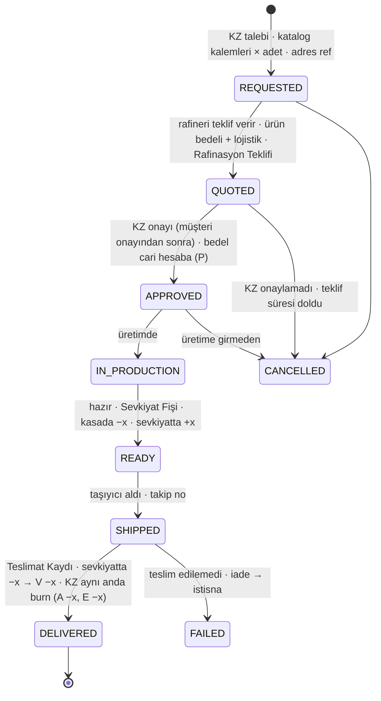

**Defter:** talep anında token → burn cüzdanı (`E +x`) · APPROVED: `P[kur] −(ürün bedeli + lojistik)` · READY / DELIVERED kasa etkisi 10 ile aynı · Kanzasset marjı ve komisyonu müşteri tarafında, rafineriye gitmez

**Katalog örneği:** 1 g · 2,5 g · 5 g · 10 g · 20 g · 50 g · 100 g · 250 g · 500 g · 1 kg külçe; ayar 999,9; kalem başına tarife ve üretim süresi; özel ambalaj seçeneği. Katalog değişince KZ `GET /v1/catalog` ile güncel listeyi çeker (`catalog.updated` olayı).

---

## 12 · Mahsuplaşma (altın + para)

Gün içinde biriken karşılıklı alacak ve borçların (gram ve para) tek seferde kapatılması. İçindeki **mutabakat** adımı iki tarafın ekstrelerinin birebir karşılaştırılmasıdır. **Tetik:** gün sonu kesim **17:00 Dubai** · **iki taraftan birinin talebi** ("şimdi netleş"; karşı tarafa bildirim düşer) · cari hesap limiti (K3). **Talep gelmese de** kesim saatinde mahsuplaşma kendiliğinden başlar; kesim saati, saat dilimi ve gün içi pencere sayısı panelden ayarlanır (R10 / K9, `settlement.cutoff_local`, `settlement.timezone`, `settlement.windows_per_day`). **Sıklık parametre:** gün sonu (`N = 1`) ya da gün içi pencereler (`N` / gün); iki şirket aynı bankada hesap tutarsa transfer anlık olur ve pencere sıklığı artırılabilir. Mint ve burn'de yeni fiyat alınmaz: her gram müşteri emrinde alındı ya da satıldı.

**Adımlar:**

1. Pencere kapanır; iki taraf da ekstre hazırlar: işlem listesi · `T` net gram · kur bazında para (alış satış bedelleri + lojistik ve rafinasyon bedelleri) · hizmet bedelleri.
2. **Mutabakat:** iki ekstre karşılaştırılır; bakiye bilgisi sayesinde birebir eşit olmalı; fark → `RECONCILE`, ödeme bekler.
3. **Altın bacağı:** `T > 0` → kasa girişi `T` + mint `T` (05) · `T < 0` → burn `|T|` + kasa çıkışı `|T|` (06) · sonuç `T = 0`, `S = K = hedef`.
4. **Para bacağı:** kur bazında net → borçlu öder, banka hesabından banka hesabına, Kanzasset tarafında yalnız şirket hesabı (K5) · ödeme bildirimi · karşı taraf "ödeme alındı" der → `SETTLED`.
5. Limit sayaçları sıfırlanır.

<!-- cap: Örnek · gün sonu kesimi · T +7.000 g · USD net Kanzasset → AMR -->
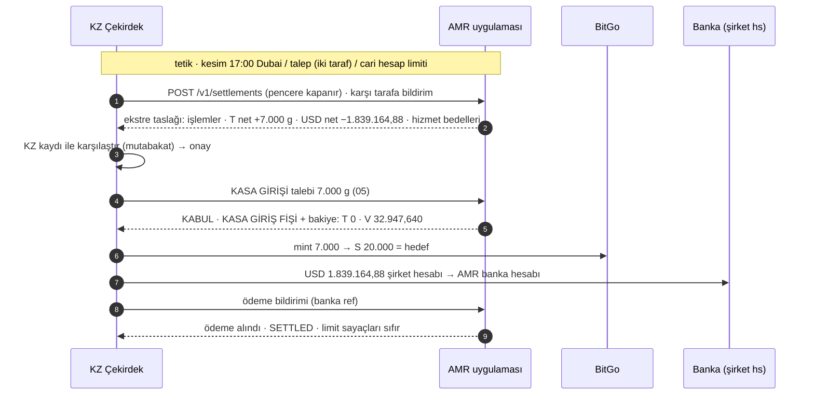

**Örnek gün (rakamlar 03, 04, 07 ile aynı; ask 142,00 · bid 141,80 USD/g):**

| Adım | Hareket | S | T | V | A | Kontrol |
|---|---|---|---|---|---|---|
| Açılış | 20 kg alındı, kasaya girdi, mint (09) | 20.000 | 0 | 20.000 | 20.000 | S + T = 20.000 ✓ · A = V ✓ |
| Gün içi | stoktan alışlar toplam 947,640 g (03) | 19.052,360 | +947,640 | 20.000 | 20.000 | ✓ |
| Gün içi | büyük alış 15.000 g, eksik 5.947,640 kasa girişi + mint (07) | 10.000 | +10.000 | 25.947,640 | 25.947,640 | ✓ |
| Gün içi | stoktan satışlar toplam 3.000 g (04) | 13.000 | +7.000 | 25.947,640 | 25.947,640 | ✓ |
| 17:00 | altın bacağı: kasa girişi 7.000 + mint 7.000 | 20.000 | 0 | 32.947,640 | 32.947,640 | S = hedef ✓ · A = V ✓ |
| 17:00 | para bacağı: alışlar 15.947,640 g × 142,00 = 2.264.564,88 · satışlar 3.000 g × 141,80 = 425.400,00 · **net 1.839.164,88 USD Kanzasset → AMR** | | | | | şirket hesabından ✓ |

Gün sonunda `C = 12.947,640`, `A = S + C = 32.947,640` ✓. Gün içi en yüksek `|T|` = 10.000 g (≈ 1,42 M USD): cari hesap limiti buna göre seçilir.

**Not:** Cari hesap gün içinde Kanzasset'i rafineriye borçlu kılabilir. Bu yüzden cari hesap limiti, talep üzerine mahsuplaşma ve sözleşmede kasa hesabına rücu yasağı gerekir. Pencere sıklığı parametre olduğu için daha sık mahsuplaşmaya geçiş kod değil konfigürasyondur.

---

## Durum · Cevapsız emir

Bu bir akış değil, bir durumdur: rafineriye gönderilen emre zaman sınırı içinde cevap gelmezse ne olur. İş kuralı: emir iptal edilir ve bloke çözülür. Teknik sıra, çift işlem riskine karşı: önce durum sorgusu, sonra iptal talebi; rafineri kesin cevap verir.

<!-- cap: Zaman aşımı yolu -->
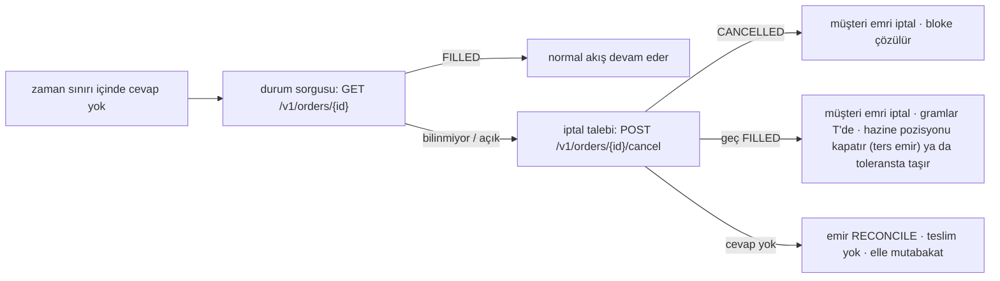

**Not:** Geç fill durumunda `S + T = K + x` olur (küçük pozisyon). Varsayılan: hazine aynı miktarı ters emirle kapatır; parametre ile tolerans bandında taşınabilir. Müşteriye karşı sonuç her zaman kesindir: iptal ve bloke çözümü.

---

## Kontrol · Düzenli kontroller

Bunlar talep değil, sistemin düzenli olarak yaptığı gram ve defter doğrulamalarıdır; para tarafının netleşmesi mahsuplaşmadır (12). Dört halka, dört zaman ölçeği.

<!-- cap: Kontrol halkaları -->
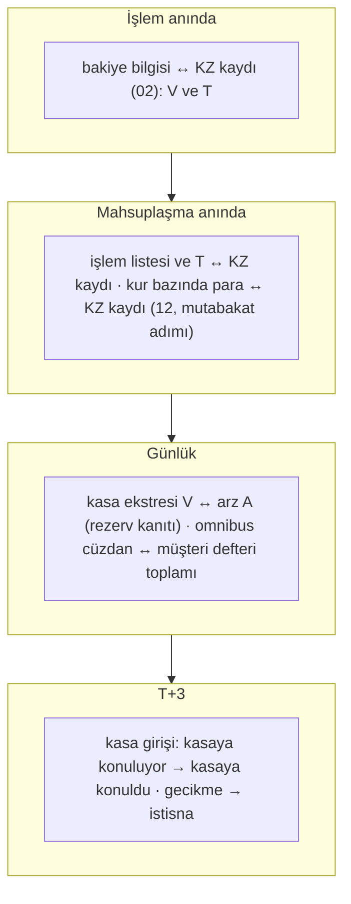

**İstisnalar:** bakiye uyuşmazlığı → `RECONCILE` (02) · "kasaya konuldu" gecikti → uyarı, yeni mint bloke · `kasaya konuluyor` tavanı aşıldı → kasa girişi talebi durur, alım devam eder (T'de birikir, K3 limiti izler) · kasa ekstresi `V < A` → işlem durur, acil mahsuplaşma.

---

## Belgeler (fişler)

| Belge | Kim üretir | Ne zaman | İçerik | Ne tetikler |
|---|---|---|---|---|
| **Fill** | AMR | Emir gerçekleşince | order id · yön · gram · fiyat · kur · tutar · ts · quote seq | Teslim ya da ödeme (müşteri tarafı) |
| **Tahsis Belgesi** (T+0) | AMR | Her alışta, fatura ile aynı mesajda | belge no · gram · ayar 999,9 · "Kanzasset FZCO adına" · **mülkiyet devri, retention of title ve lien yok** · imza | `T` artı bakiye bizim malımız; cari hesap kalemi |
| **Kasa Giriş Fişi** | AMR | Kasa girişi talebi kabul edilince | fiş no · gram · KZ ref · "kasa hesabında Kanzasset FZCO adına" · zaman · imza | **Mint** (K4, KZ tarafı) · `T −q`, `kasaya konuluyor +q` |
| **Kasa Çıkış Fişi** | AMR | Kasa çıkışı talebi kabul edilince | fiş no · gram · KZ ref · zaman · imza | `kasada −b`, `T +b` |
| **Lojistik Teklifi** | AMR | Fiziksel teslimat talebine fiyat girilince | talep id · taşıyıcı · tutar · kur · geçerlilik | KZ onayı → `P` kalemi |
| **Rafinasyon Teklifi** | AMR | Rafinasyon talebine teklif verilince | talep id · kalemler · ürün bedeli · lojistik · üretim süresi · geçerlilik | KZ onayı → `P` kalemi |
| **Sevkiyat Fişi** | AMR | Külçe / ürün sevkiyata hazır olunca | fiş no · gram · talep id · zaman | `kasada → sevkiyatta` (10, 11) |
| **Teslimat Kaydı** | AMR / taşıyıcı | Müşteriye teslim edilince | taşıyıcı · takip no · zaman · imza | `sevkiyatta −x` · KZ burn |
| **Fatura / hizmet bedeli faturası** | AMR | Asenkron | alış kalemi · lojistik · rafinasyon | Cari hesap kalemi (para) |
| **Günlük Kasa Ekstresi** | AMR | Günlük (kesimde) | kasada · kasaya konuluyor · sevkiyatta · tüm fiş referansları | **Rezerv kanıtı** (`V ≥ A`) |
| **Cari Hesap Ekstresi** | AMR | Her mahsuplaşma penceresi | işlem listesi · `T` hareketleri · kur bazında para | Mahsuplaşma adım 1 |
| **Mahsuplaşma Ekstresi** | Tetikleyen taraf; iki taraf onaylar | Kesim / talep / limit | altın bacağı talimat ref'leri · kur bazında net ve yön · hizmet bedelleri · ödeme ref | Ödeme (banka → banka) |
| **İşlem dekontu** | KZ | Her müşteri emrinde | tek fiyat (marj gömülü) · komisyon %0,15 ayrı · varsa dönüşüm satırı | Müşteri kaydı |

Tüm fişler ve ekstreler iki tarafta da görüntülenir ve indirilir; gönderim zamanı ve imza doğrulaması ile.

---

## API (AMR uygulaması → KZ)

| Uç | Ne yapar | Cevap / olay |
|---|---|---|
| WS `/v1/prices` | fiyat yayını: fotoğraf + tick + heartbeat (01) | `{type, seq, ts, prices[], tradable}` |
| `GET /v1/session/status` | oturum durumu: açık / durdu / bakım · merkez bağlantısı | `tradable` bayrağının yanında |
| `POST /v1/orders` | alış / satış emri · `client_order_id` · 0,001 g · `quote_seq` · `limit_px` (slippage) · `FOK` · `time_limit_ms` | fill + Tahsis Belgesi (alışta) + bakiye bilgisi (02) |
| `GET /v1/orders/{id}` · `POST /v1/orders/{id}/cancel` | durum sorgusu · iptal talebi, kesin cevap (Cevapsız emir) | `FILLED` / `CANCELLED` / `REJECTED` |
| `POST /v1/vault/in` | kasa girişi talebi: `qty_mg` · `ref` (05) | `REQUESTED`; kabulde `vault.in_accepted` + Kasa Giriş Fişi + bakiye; sonra `vault.in_placing`, `vault.in_placed`; vade geçerse `vault.in_overdue` |
| `POST /v1/vault/out` | kasa çıkışı talebi: `qty_mg` · `ref` (06) | `REQUESTED`; kabulde `vault.out_accepted` + Kasa Çıkış Fişi + bakiye |
| `GET /v1/vault/requests/{id}` · `GET /v1/vault/statement?date=` | kasa talimatı durumu · günlük kasa ekstresi (05, 06, Kontroller) | durum ve geçmiş · rezerv kanıtı (`V ≥ A`), fiş referansları ve imza |
| `POST /v1/deliveries` · `POST /v1/deliveries/{id}/approve` · `POST /v1/deliveries/{id}/cancel` · `GET /v1/deliveries/{id}` | fiziksel teslimat: talep (gram · adres ref) · teklif onayı · iptal · durum (10) | `delivery.quoted` · `delivery.*` durum olayları |
| `GET /v1/catalog` | rafinasyon ürün kataloğu (ürün · gramaj · ayar · tarife · süre) (11) | `catalog.updated` olayı |
| `POST /v1/refining` · `POST /v1/refining/{id}/approve` · `POST /v1/refining/{id}/cancel` · `GET /v1/refining/{id}` | rafinasyon: talep (kalemler × adet · adres ref) · teklif onayı · iptal · durum (11) | `refining.quoted` · `refining.*` durum olayları |
| `GET /v1/account` | anlık fotoğraf: `seq` · `vault{in_vault, placing, shipping}` · `current_account{gold_mg, money[]}` · `status` | (02) |
| `GET /v1/vault/statement?date=` | günlük kasa ekstresi (rezerv kanıtı), fiş referanslarıyla | Kontroller |
| `GET /v1/current-account/statement?window=` | cari hesap ekstresi: işlemler · `T` hareketleri · kur bazında para | (12, adım 1) |
| `POST /v1/settlements` · `GET /v1/settlements/{id}` · `POST /v1/settlements/{id}/confirm` · `POST /v1/settlements/{id}/payment-notice` · `POST /v1/settlements/{id}/payment-received` | mahsuplaşma: pencere (iki taraf da çağırabilir; karşı tarafa `settlement.requested`) · ekstre · mutabakat onayı · ödeme bildirimi · ödeme alındı (12) | `settlement.*` olayları |
| `GET /v1/documents/{id}` | Tahsis Belgesi · Kasa Giriş / Çıkış Fişi · Lojistik ve Rafinasyon Teklifi · Sevkiyat Fişi · Teslimat Kaydı · fatura · ekstreler | PDF + imza |
| Olaylar (webhook) | `order.*` · `vault.in_accepted / in_placing / in_placed / in_overdue / in_rejected` · `vault.out_accepted / out_rejected` · `delivery.*` · `refining.*` · `catalog.updated` · `settlement.requested / statement / reconciled / mismatch / payment_notice / settled` · `price.halt / resume` · `account.reconcile`; zarf: bakiye bilgisi + HMAC imza + idempotency key + `seq` | iki tarafta bildirim üretir |

Güvenlik ve işletim: mTLS ya da HMAC imza · API anahtarı / istemci · idempotency key · `seq` · iki tarafta istek günlüğü ve saklama (VARA kanıt) · saat senkronu · uyum test paketi her canlıya çıkışta.

---

## Parametreler (config, kod değil)

| Parametre | Örnek değer | Tetiklediği |
|---|---|---|
| Envanter hedefi `K` | 20.000 g / 20.000 AGOLD | K2, mahsuplaşmada hedefe dönüş |
| Stok tabanı · tavan | 10.000 · 21.000 | 07 (önce mint) · 08 (fazlayı burn) |
| Mint politikası (07) | `SHORTFALL` (eksik kısım) · `FULL_ORDER` | kasa girişi miktarı |
| Tavan aşımında burn hedefi | hedefe (20.000) | 08 miktarı |
| Kasa talimatı kabulü (rafineri) | elle (varsayılan) · otomatik · hedef cevap süresi 15 dk | 05, 06 |
| Kasaya koyma vadesi | en geç T+3 | "kasaya konuldu" beklentisi, uyarı |
| `kasaya konuluyor` tavanı | ör. 10.000 g | kasa girişi talebi durur, alım devam eder |
| Mahsuplaşma kesimi · pencere sayısı | 17:00 Dubai · `N = 1` (gün sonu) | 12 |
| Cari hesap limiti | altın ör. 15.000 g · para kur bazında ör. 2,5 M USD karşılığı | mahsuplaşma çağrısı ya da işlem durdurma (K3) |
| Slippage toleransı | %0,2 ile %5 arası, varsayılan %1 | emir `limit_px` / taban |
| Emir zaman sınırı | ör. 3 sn | Cevapsız emir |
| Fiyat bayatlık eşiği · heartbeat | 10 sn · 5 sn | 01, işlem durur |
| Burn anı (teslimat, rafinasyon) | `DELIVERED` (varsayılan) · `SHIPPED` | 10, 11 (KZ tarafı) |
| Teklif geçerlilik süresi | lojistik 24 sa · rafinasyon 48 sa | 10, 11 |
| Emir minimumu | 10 USD karşılığı | emir fişi |
| Kâr marjı · işlem komisyonu · dönüşüm ücreti | hedef %0,30 / tavan %1,00 · %0,15 · ~%0,1 | fiyat zinciri (01), müşteri tarafı |
| Onay matrisi (hazine alım satımı) | ≤5 kg 1 · ≤15 kg 2 · üstü 3 | 09 |
