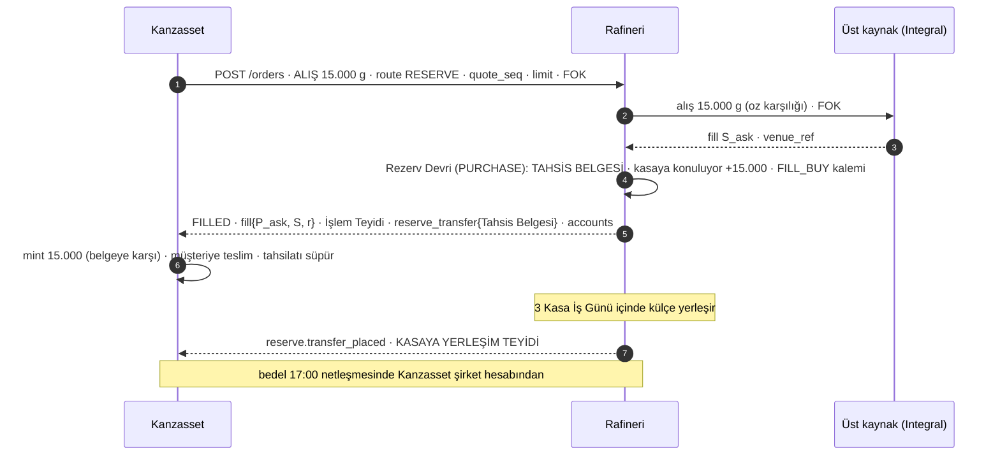
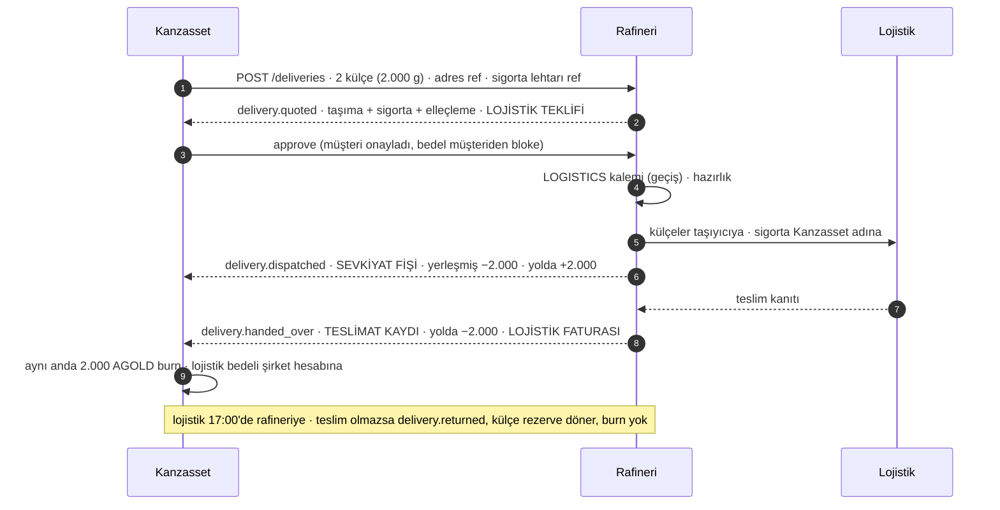

# Kanzasset ↔ AMR · Rafineri modeli (Operating Model v0.8 karşılığı)

**1 Ekim 2026 · taslak 1** · Kaynak: *Kanzasset Operating Model Specification v0.8* (29 Eylül 2026). Bu doküman o spesifikasyonun **rafineriyi ilgilendiren** kısmını alır ve üç soruya cevap verir: rafineride hesaplar ve defterler nasıl tutulur (Bölüm 1), iki taraf nasıl konuşur, hangi API'ler gerekir (Bölüm 2), rafineri sisteminde hangi ekranlar ve akışlar olur (Bölüm 3). Bölüm 4 rafinerinin üst kaynağa (Integral) bağlantısını, Bölüm 5 parametreleri ve rafineriden beklenen cevapları, Bölüm 6 mevcut sistemle farkları ve uygulama sırasını verir.

**Öncelik sırası:** spesifikasyon v0.8 → bu doküman → `KZ_AMR_Akislar.md` ve `KZ_AMR_Sistemi.md` → kod. Çelişkide üstteki kazanır; alttaki düzeltilir.

**Kapsam dışı:** Kanzasset'in müşteri tarafı (cüzdanlar, BitGo, Client Money, Travel Rule, dondurma, quorumlar; spesifikasyon bölüm 4, 12, 13, 15, 17'den 20'ye). Rafineri bunları görmez. Rafineri tarafında oturum açma ve kullanıcı yönetimi de kapsam dışıdır: rafineri bu modülü mevcut sistemine ekleyecek, kimlik oradan gelecek; biz yalnız **hangi aksiyonun hangi yetkiye bağlı olduğunu** veririz.

---

## 0. Özet: ne değişiyor, ne aynı kalıyor

Mevcut tasarım spesifikasyonla büyük ölçüde birebir örtüşüyor. **İki hesap** (Kasa Hesabı `V`, Cari Hesap `T` + `P`) spesifikasyonda **üç hesap** olarak adlandırılıyor; cari hesabın altın yüzü ile para yüzü iki ayrı hesap oluyor:

| Spesifikasyon | Bizim sembol | Ne | Mevcut karşılığı |
|---|---|---|---|
| **Segregated Reserve Account** · Ayrılmış Rezerv Hesabı (kısaca **Rezerv Hesabı**) | `V` | Her AGOLD'u karşılayan fiziksel altın. Kanzasset'in mülkü, ayrı ve işaretli alanda, ödünç verilmez, rehnedilmez, mahsup edilmez. Üç alt bakiye: **yerleşmiş** · **tahsis edildi, yerleşim bekliyor** · **yolda** (itfa için sevk edildi, henüz teslim edilmedi) | Kasa Hesabı: `kasada` · `kasaya konuluyor` · `sevkiyatta`. **Birebir aynı.** |
| **Metal Position Account** · **Metal Pozisyon Hesabı** | `T` | Kayden tutulan metal hesabı: müşteri emirlerinin stoktan karşılanan her fill'i aynı gramla buraya yansır. Artı: rafineri bize metal borçlu; eksi: biz rafineriye borçluyuz. Bant **+10 kg / −1 kg**. Rezerv Varlıklarının parçası değildir | Cari hesabın altın yüzü `T`. **Aynı işaret, aynı tanım; sınır asimetrik oldu.** |
| **Refinery Settlement Account** · **Rafineri Mahsuplaşma Hesabı** | `P[kur]` | Sözleşmesel nakit hesabı (banka hesabı değil): her alış satışın bedeli, rezerv çıkışlarının bedeli, itfa ödemeleri (AED dahil), lojistik faturaları, kur bazında netleşir ve **her gün 17:00'de** ödenir | Cari hesabın para yüzü `P` + mahsuplaşma (12). **Aynı; günlük netleşme ve gün içi çağrı kuralları netleşti.** |

Üç hesap üç ayrı ekstreyle raporlanır; Kanzasset'in günlük beş kontrolünden üçü bu ekstrelerle çalışır: **I1** rezerv = arz (Rezerv Hesabı ekstresi), **I2** hazine stoku + metal pozisyonu = açılış devri (Metal Pozisyon ekstresi), **I5** pozisyon bant içinde ve nakit mutabık (Mahsuplaşma Hesabı ekstresi). Bizim K1, K2, K3 kontrollerimiz bunların karşılığıdır.

**Gerçekten değişen on şey:**

1. **Rafineri fiyatı `S × (1 ± r)`.** Rafineri kendi kaynağından aldığı `S` fiyatına **marj `r`** uygular (tavan %1,00, beklenen 3 ile 5 bp, her şey dahil, ayrı hizmet tarifesi yok). Her fill'de `S`, `r` ve sonuç fiyatı kayda geçer; Kanzasset bunları kendi işlem günlüğüne yazar (6.2, 6.4). Önceki "rafineri fiyata dokunmaz" kararımız kalkıyor.
2. **Rafineri emirleri üst kaynağa iletir.** Rafineri bağımsız bir karşı taraf değil, bizden gelen emri kendi bağlantısı üzerinden **Integral**'e gönderen ve oradan gelen cevaba göre bize teyit dönen bir aracıdır. Bizim sözleşmemiz zaten FIX mantığındadır (FOK, `client_order_id`, `quote_seq`, `limit_px`, `time_limit_ms`); rafineri tarafında bir **üst kaynak adaptörü** gelir, test ortamında bu adaptör hep fill döner, davranışları test edilir (Bölüm 4).
3. **Belge adları yerine oturur.** *Allocation Certificate* (Tahsis Belgesi) her alışta değil, yalnız **Rezerv Devri**'nde kesilir: bugünkü Kasa Giriş Fişi'nin yerini alır ve **mülkiyet o anda geçer**. Alış satış fill'leri **İşlem Teyidi** alır. Fiziksel yerleşim için yeni belge **Kasaya Yerleşim Teyidi** (*Vault Entry Confirmation*, en geç 3 Kasa İş Günü). Kasa Çıkış Fişi **Rezerv Çıkış Teyidi** olur.
4. **Taahhütlü Rezerv Çıkışı** (*Committed Reserve Release*) yeni bir nesnedir: büyük satışta (−1 kg'ın ötesi) ve AED itfasında rafineri fiyatı **Kanzasset müşteri fiyatını sabitlediği anda** taahhüt eder, çıkış **burn'den sonra** yapılır, bedel 17:00'de netleşir. İtfa AED cinsindendir ve T+3'te öder (10.5, 11.4, 11.5).
5. **Açılış devri `K` sabittir** (20.000 g; yalnız Board kararıyla değişir). Bugünkü "hazine alım satımı `K`'yi değiştirir" kuralı kalkar. Yerine iki iş vardır: **pozisyondan rezerve devir** (dengeleme: `T` artıdan Rezerv Devri + mint) ve **zorunlu çıkış** (`T = −1 kg`'da burn + Rezerv Çıkışı). İkisi de `K`'yi değiştirmez (7.2, 7.3).
6. **İki pozisyon modu:** *taşıma* (pozisyon gün aşırı taşınır, +10 kg'da dengeleme zorunlu, −1 kg'da çıkış zorunlu) ve *günlük netleşme* (17:00'de pozisyon sıfırlanır: net alış rezerve devredilir ve mint, net satış burn ve çıkış). Günlük netleşme modu bizim mahsuplaşmanın altın bacağının ta kendisidir (7.2A). Mod Kanzasset parametresidir (CFO).
7. **Metal pozisyon sınırı asimetrik:** +10 kg (rafineriye teminatsız alacak, ilişkili taraf limiti) / −1 kg (nakitle karşılanır; Mahsuplaşma Hesabı'nda en az eksi pozisyonun değeri kadar nakit durur, Rezerv Hesabı'na mahsup yoktur) (7.3, 7.4).
8. **Mahsuplaşma Hesabı kuralları:** günlük netleşme **17:00 Dubai**; gün içi netleşmeyi **Kanzasset her an**, **rafineri 2 saat önceden haber vererek** çağırır; aralık içinde rafineri Kanzasset'e **avans** verebilir (kredi değil, zamanlama; 17:00'de netleşir, rezerv üzerinde hiçbir hak doğurmaz); lojistik faturaları **maliyet bedeli geçiş kalemi**dir, marjsız (8.1, 8.3, 14.2A).
9. **Fiziksel itfa yalnız 1 kg külçe**, 1.000 AGOLD katları; UAE içi 5 iş günü; yoldaki altın rezerv ekstresinde **yolda** görünür ve sigorta teslime kadar Kanzasset adınadır; teslim olmazsa altın rezerve döner, hiçbir şey yakılmaz (14.1, 14.4, 14.6). **Rafinasyon lansmanda yoktur** (14.1); kod kalır, menüden gizlenir.
10. **İşlem saatleri rafinerinin kotasyonuna bağlıdır:** birincil 7/24 (günlük bakım penceresiyle), yedek COMEX'e hizalı 23 × 5; **Kasa İş Günü** takvimi rafineriden gelir; Tahsis Belgesi kotasyon varken kesilir, yerleşim, Yerleşim Teyidi ve satışla çıkış Kasa İş Günü'nde yapılır (14B.2).

**Aynı kalanlar:** fiyat soketi (seq, heartbeat, 10 sn bayatlık, üç kur, boyuttan bağımsız), HMAC kimlik, olaylar ve `event_id` ile tekrar ayıklama, FOK emir ve cevapsız emirde kesin cevap, kasa taleplerinin elle kabulü ve fiş üretimi, T+3 yerleşim ve vade uyarısı, "rafineri Kanzasset'in talebi olmadan kasadan gram çıkaramaz" kuralı, burn'ün çıkıştan önce olması, mint'in yalnız belgeye karşı olması, mahsuplaşma penceresi, mutabakat, bacaklar ve kısmi mahsuplaşma, belgelerin JSON + sha256 + imza + PDF olması, ikinci onay, denetim ve istek günlükleri.

Terimler tablosu Bölüm 5.3'tedir.

---

## 1. Rafinerideki üç hesap ve defterler

Kanzasset FZCO adına rafineride üç hesap vardır. Üçü de **hareket tablolarından türer**, bakiye tablosu yoktur (bugünkü defter yapımız aynen kalır); her hareket demeti bir `account_seq` alır ve bakiye bilgisinde döner.

### 1.1 Rezerv Hesabı (Segregated Reserve Account) · `V`

**Ne tutar:** Kanzasset'in mülkü olan fiziksel altın, 999,9 ayar, gram (üç ondalık), külçe seri numarası yok. Yalnız Rezerv Varlıkları; başka hiçbir şey bu hesapta durmaz.

**Üç alt bakiye** (ekstrede üçü de Rezerv Varlığı sayılır):

| Alt bakiye | Bizim adımız | Nasıl girer | Nasıl çıkar |
|---|---|---|---|
| **Yerleşmiş** (placed) | `kasada` | Kasaya Yerleşim Teyidi ile (tahsisten geldi) · itfa iadesi (teslim olmadı, külçe döndü) | Rezerv Çıkışı (satış, taahhütlü dahil) · itfa için sevkiyat (→ yolda) |
| **Tahsis edildi, yerleşim bekliyor** (allocated awaiting placement) | `kasaya konuluyor` | Rezerv Devri kabulü: **Tahsis Belgesi** kesilir, mülkiyet o anda geçer | Kasaya Yerleşim Teyidi ile yerleşmişe geçer; en geç **yerleşim süresi** (3 Kasa İş Günü) |
| **Yolda** (in transit) | `sevkiyatta` | Fiziksel itfa Çıkış Emri'nde külçe sevke verilince | Teslimde (mülkiyet alıcıya geçer, `V −x`) · teslim olmazsa iade (→ yerleşmiş) |

**Kurallar:**

- Rezerv Hesabı yalnız **Kanzasset'in talimatıyla** hareket eder: Rezerv Devri talebi, Rezerv Çıkışı talebi (burn referansıyla), Taahhütlü Çıkış'ın icrası (burn referansıyla), fiziksel itfa Çıkış Emri. Rafineri kendi başına gram çıkaramaz, eksi metal pozisyonunu rezervden kapatamaz: **mahsup yoktur**.
- **Mülkiyet Tahsis Belgesi'yle geçer.** Retention of title yok, rehin yok, lien yok. Belge metninde bu yazar (bugünkü Tahsis Belgesi metni Rezerv Devri belgesine taşınır).
- **Yerleşim süresi**: her tahsisin bir vadesi vardır (kabul + 3 Kasa İş Günü). Vadesi geçen tahsis ekstrede **ayrı listelenir**; Kanzasset tarafında I1 kırılması sayılır ve mint durur (A1.3). Bugünkü `OVERDUE` durumu ve `vault.in_overdue` olayı aynen kalır.
- **Burn önce, çıkış sonra:** her Rezerv Çıkışı talebi bir **burn referansı** taşır; referanssız talep reddedilir. Rezerv geçici olarak arzın üstünde olabilir, altına hiç inmez (7.7). Fiziksel itfada sıra tersine döner: önce teslim, teslimle birlikte burn (14.4); yoldaki gram teslime kadar rezervdir.
- **Ekstre** (günlük, kesimde ve istendiğinde): açılış ve kapanış üç alt bakiye, günün hareketleri, belge referansları, **vadesi geçen tahsisler listesi**, yoldaki külçeler (çıkış emri, taşıyıcı, takip no), imza. Kanzasset I1'de bunu zincir üstü arz ve kendi Rezerv Olay Defteri ile üçlü karşılaştırır.

**Rafineri defteri (`reserve_events`):** `event_id` · tür (`ALLOCATION` tahsis · `PLACEMENT` yerleşim · `RELEASE` çıkış · `DISPATCH` sevk · `HANDOVER` teslim · `RETURN` iade) · `qty_mg` · `fineness` · Kanzasset referansı · ilgili talep / çıkış emri · belge no · zaman · aktör. Üç alt bakiye bu tablodan türer (bugünkü `vault_movements` tablosunun adı ve hareket adları değişir, yapısı aynıdır).

### 1.2 Metal Pozisyon Hesabı (Metal Position Account) · `T`

**Ne tutar:** iki taraf arasında **kayden** borçlu olunan metal; ayrılmış bir külçe yoktur. Müşterinin stoktan karşılanan her alışı pozisyonda Kanzasset'in bir alışı, her satışı bir satışıdır; aynı gram, **aynı fiyat anı** (`quote_seq`). Böylece hazine stoku + metal pozisyonu = açılış devri (**I2**, bizim K2) her an tutar ve Kanzasset müşteri akışından yön riski taşımaz (7.1).

**İşaret:** `T > 0` rafineri Kanzasset'e metal borçlu (müşteriler aldı, gram henüz rezerve devredilmedi); `T < 0` Kanzasset rafineriye borçlu (müşteriler sattı, gram henüz rezervden çıkmadı). Bugünkü tanımla aynıdır.

**Bant:** `−1 kg ≤ T ≤ +10 kg` (**I5**, bizim K3'ün yerini alır; simetrik limit yerine asimetrik bant). Artı taraf ilişkili tarafa teminatsız alacaktır ve risk iştahında onaylı limittir; eksi taraf nakitle karşılanır (Mahsuplaşma Hesabı'nda en az o değer kadar nakit). Günlük netleşme modunda gün içinde −1 kg'ın altına inilebilir (gün içi limit, CFO belirler), netleşmede sıfırlanır.

**Pozisyon nasıl kapanır:**

- **Dengeleme (`T > 0`):** Kanzasset istediği an, pozisyon bakiyesine kadar herhangi bir miktarı rezerve devreder: `POST /reserve/transfers` (kaynak `POSITION`) → rafineri kabul eder, **Tahsis Belgesi** keser → `T −q`, `kasaya konuluyor +q` → Kanzasset mint eder. Stok 10 kg'a (T_low) inince, yani `T = +10 kg` olunca dengeleme zorunludur (7.2).
- **Zorunlu çıkış (`T = −1 kg`):** Kanzasset fazla tokenleri yakar, `POST /reserve/releases` (burn referansıyla) gönderir → rafineri kabul eder, **Rezerv Çıkış Teyidi** keser → `kasada −q`, `T +q` → `T = 0` (7.3).
- **Günlük netleşme modunda** ikisi de 17:00'de kendiliğinden olur: bugünkü mahsuplaşma altın bacağı (rafineri "kasaya koyalım mı" teklif eder, Kanzasset onaylar ve devir talebi gönderir; ya da Kanzasset yakar ve çıkış talebi gönderir).

**Büyük emirler pozisyona girmez:**

- **Büyük alış** (fill stoku 10 kg'ın altına indirecekse, 7.5 / 9.6): emir rafineriye gider, rafineri üst kaynaktan alır, **aynı anda Rezerv Devri** yapılır (kaynak `PURCHASE`, emir referansıyla): Tahsis Belgesi kesilir, gram doğrudan `kasaya konuluyor`'a girer, `T` değişmez. Kanzasset mint eder ve teslim eder. Bedel Mahsuplaşma Hesabı'nda 17:00'de ödenir. Yerleşim 3 Kasa İş Günü içinde.
- **Büyük satış** (−1 kg'ın ötesi, 7.6 / 10.5): fazla kısım için **Taahhütlü Rezerv Çıkışı** açılır (fiyat o anki rafineri bid'i); Kanzasset müşteriye öder, tokenleri yakar, taahhüdü **icra** eder (burn referansıyla) → Rezerv Çıkış Teyidi → `kasada −q`; `T` değişmez.

**Rafineri defteri (`position_fills`):** `fill_id` · emir no (`client_order_id`, `order_id`) · yön · `qty_mg` · `quote_seq` · kaynak fiyatı `S` · marj `r` (bps) · rafineri fiyatı `P` · kur · tutar (cent) · üst kaynak referansı (`venue_ref`) · zaman; artı pozisyondan devirler ve zorunlu çıkışlar (`POSITION_TRANSFER`, `FORCED_RELEASE`) aynı tabloda ters işaretli satırdır. `T` bu tablodan türer (bugünkü `current_account_movements` altın satırları).

**Ekstre** (pencere bazında ve günlük): açılış `T`, her fill (emir, yön, gram, `S`, `r`, `P`, kur, tutar, `quote_seq`, üst kaynak referansı), devirler ve çıkışlar, kapanış `T`, bant kullanımı, imza. Kanzasset I2'de bunu kendi Metal Pozisyon Defteri ile karşılaştırır (bugünkü eşleşme kontrolünün aynısı: fark → `RECONCILE`, mint ve çıkış bloke).

### 1.3 Rafineri Mahsuplaşma Hesabı (Refinery Settlement Account) · `P[kur]`

**Ne tutar:** iki tarafın birbirine kur bazında (USD, EUR, AED) borçlu olduğu nakit. Sözleşmesel hesaptır, banka hesabı değildir; para fiilen **banka hesabından banka hesabına** 17:00 netleşmesinde gider. Kanzasset tarafında yalnız şirket hesabı öder (K5).

**Kalemler** (`settlement_items`): 

| Kalem | İşaret (Kanzasset açısından) | Kaynak |
|---|---|---|
| `FILL_BUY` pozisyon alışı bedeli | borç | emir fill'i (03), büyük alış (07) |
| `FILL_SELL` pozisyon satışı bedeli | alacak | emir fill'i (04) |
| `RELEASE` rezerv çıkışı bedeli (satışla çıkış) | alacak | zorunlu çıkış, günlük netleşmede net satış |
| `COMMITTED_RELEASE` taahhütlü çıkış bedeli | alacak | büyük satış icrası, AED itfası icrası (T+3) |
| `LOGISTICS` lojistik faturası (taşıma, sigorta, elleçleme) | borç, **geçiş kalemi, marjsız** | fiziksel itfa (14.2A) |
| `ADVANCE` aralık içi avans | borç (rafineri ödedi, 17:00'de netleşir) | rafineri, Kanzasset'in isteğiyle (8.3) |
| `PAYMENT` netleşme ödemesi | kapatır | 17:00 netleşmesi ya da gün içi netleşme |

**Kurallar (8.1 ile 8.3):**

- Her işlem **anında mutabık** (bakiye bilgisiyle), nakit **günlük 17:00'de** netleşir. Bu aralık kredi hattı değildir ve öyle adlandırılmaz.
- Gün içi netleşmeyi **Kanzasset her an** çağırır; **rafineri yalnız 2 saat önceden haber vererek** (`effective_ts = now + 2 sa`): Kanzasset'in o günkü müşteri tahsilatı kendisine geçip süpürülmeden ödeme istenmez. Gün içi netleşme yalnız o ana kadarki kalemleri kapatır, 17:00 netleşmesi sonrakileri.
- **Avans:** aralık içinde rafineri Kanzasset'e nakit verebilir (ör. müşteri satış bedeli rezerv çıkışı netleşmeden ödensin diye). 17:00'de netleşir, rezerv üzerinde hak doğurmaz, belgede "mahsuplaşma zamanlaması" diye geçer. Kanzasset dilerse avans yerine gün içi netleşme çağırır.
- **Eksi pozisyon teminatı:** `T < 0` iken Kanzasset bu hesapta en az `|T| × fiyat` kadar nakit tutar (7.3). Rafineri ekranı bunu gösterir; aşımda uyarı.
- **Lojistik faturaları** itfa talebine bağlı ayrı satırdır; Kanzasset bunu müşteriden aynen tahsil eder, gelir yazmaz, 17:00'de rafineriye öder.
- **İlişkili taraf:** işlem bazında onay yoktur; yıllık Board kararı tip ve fiyat formülüyle (6.2) yıllık brüt tavan içinde onaylar. Rafineri tarafında bunun karşılığı yoktur; Kanzasset her rafineri işlemini kendi kaydına (II.G.6) ekstrelerden alır.

**Ekstre** (pencere bazında, kur bazında): kalem listesi, net ve yön, netleşme ödemesi ve banka referansı, avanslar, imza. Kanzasset I5'te bunu kendi Mahsuplaşma Defteri ile ve ödenen 17:00 netini karşılaştırır. Mahsuplaşma penceresi, mutabakat, bacaklar ve kısmi mahsuplaşma (bugünkü 12) aynen çalışır; altın bacağı günlük netleşme modunda vardır, taşıma modunda pencere varsayılan olarak yalnız para bacaklarını kapsar.

### 1.4 Kontroller ve değişmezler

| Spesifikasyon | Bizim | Rafineri tarafında ne yapılır |
|---|---|---|
| **I1** zincir üstü arz = Rezerv Olay Defteri = Rezerv Hesabı ekstresi (yerleşmiş + bekleyen + yolda); yerleşim süresi geçen tahsis kırılmadır | K1 `A ≤ V`, K4 | Rezerv ekstresi üç alt bakiye ve vadesi geçenler listesiyle verilir. Çıkış yalnız burn referansıyla. Kırılmada mint Kanzasset'te durur; rafineri `account.reconcile` olayı alır ve rezerv talimatı kabul etmez |
| **I2** hazine stoku + metal pozisyonu = açılış devri | K2 `S + T = K` | Pozisyon ekstresi; `K` sabit (parametre, Board) |
| **I5** `−1 kg ≤ T ≤ +10 kg`; nakit mutabık; 17:00 neti ödendi | K3 cari hesap limiti | Asimetrik bant: aşacak emir `POSITION_LIMIT` ile reddedilir; +10 kg'da dengeleme beklenir, −1 kg'da çıkış talebi beklenir; eksi pozisyonda nakit teminat göstergesi |
| Mint yalnız kayıtlı Rezerv Devri'ne karşı | K4 | Tahsis Belgesi kesilmeden `kasaya konuluyor` artmaz; Kanzasset mint'i belgeye bağlar |
| Burn önce, çıkış sonra | K4 | Rezerv Çıkışı talebi `burn_ref` ister |
| Ödeme yalnız şirket hesabından | K5 | Kanzasset tarafı; rafineri ödeme bildiriminde ödeyen hesabı görür |

### 1.5 Çalışılmış örnek (spesifikasyon 7.9, bizim sembollerle)

| Adım | Ne oldu | `S` hazine stoku | Müşteriler | `T` pozisyon | `V` rezerv | Belge |
|---|---|---|---|---|---|---|
| 0 | Açılış: 20 kg rezerve, 20.000 AGOLD mint | 20 kg | 0 | 0 | 20 kg | Tahsis Belgesi 20 kg, Yerleşim Teyidi |
| 1 | Müşteriler 6 kg aldı; pozisyonda 6 kg alış | 14 | 6 | +6 | 20 | 6 kg'lık fill'ler için İşlem Teyitleri |
| 2 | Müşteriler 3 kg daha aldı; Kanzasset bekliyor | 11 | 9 | +9 | 20 | İşlem Teyitleri |
| 3 | Dengeleme: pozisyondan 9 kg Rezerv Devri, 9.000 mint | 20 | 9 | 0 | 29 | Tahsis Belgesi 9 kg; 3 iş günü içinde Yerleşim Teyidi |
| 4 | Bir müşteri 1 kg sattı; pozisyonda 1 kg satış | 21 | 8 | −1 | 29 | İşlem Teyidi |
| 5 | Zorunlu: 1.000 AGOLD yakıldı, 1 kg Rezerv Çıkışı | 20 | 8 | 0 | 28 | Rezerv Çıkış Teyidi (burn ref) |

Her adımda `S + T = 20 kg`. Mahsuplaşma Hesabı'nda 1. ve 2. adımın alış bedelleri (borç) ve 4. adımın satış bedeli (alacak) birikir; 3. adım nakit doğurmaz (gram zaten alınmıştı), 5. adım `RELEASE` alacağı yazar; hepsi 17:00'de kur bazında netleşir.

---

## 2. İletişim: soket, API, olaylar ve akışlar

Kimlik, imza, tekrar koruması, miktar birimleri (mg, cent), tekil referanslar ve olay zarfı bugünkü gibidir (`KZ_AMR_Sistemi.md` 04, 05, 06). Aşağıda yalnız değişen ve yeni olan yazılıdır; "mevcut" denilenler aynen kalır.

### 2.1 Fiyat soketi (01)

Tick'e üç alan eklenir, bir alanın anlamı keskinleşir:

```json
{ "type": "tick", "seq": 32031, "ts": "…",
  "quoting": true,
  "markup_bps": 4,
  "prices": {
    "USD": { "source_bid": "141.80", "source_ask": "141.98", "bid": "141.74", "ask": "142.04" },
    "EUR": { … }, "AED": { … } } }
```

- `source_bid` / `source_ask` = `S` (rafinerinin üst kaynaktan aldığı fiyat), `markup_bps` = `r`, `bid` / `ask` = rafineri fiyatı `P_bid = S_bid × (1 − r)`, `P_ask = S_ask × (1 + r)`. Kanzasset fill günlüğüne `S`, `r`, `m`, komisyon ve kendi Referans Fiyatı'nı yazar (6.4); müşteriye rafineri fiyatı gösterilmez.
- `quoting` (bugünkü `tradable`): rafineri kotasyon veriyor mu. Üst kaynak bağlı değilse, rafineri elle durdurduysa, işlem saatleri dışındaysa ya da bakım penceresindeyse `false`. Kanzasset `false` iken emir kabul etmez ve kuyruğa almaz (14B.2).
- Fotoğraf mesajına **oturum bilgisi** eklenir: `session{ hours: "24x7" | "23x5", next_close_ts, next_open_ts, maintenance{from,to}, vault_business_day: true|false, next_vault_business_day }`. Değişince `session.changed` olayı.
- Bağımsız fiyat kontrolü (6.4A) Kanzasset tarafındadır: rafineri fiyatı ile Referans Fiyat arasında %1'den fazla sapma inceleme açar. Rafineriden bir şey istenmez.

### 2.2 REST API envanteri (Kanzasset → rafineri)

Durum sütunu: **M** mevcut, aynen · **D** değişir · **Y** yeni.

**Oturum ve hesaplar**

| Uç | | Ne | Kurallar |
|---|---|---|---|
| `GET /v1/session/status` | D | `quoting` · `source_connected` · `hours` · `next_close_ts` · `vault_business_day` · `markup_bps` · `ts` | kotasyon ve takvim tek uçta |
| `GET /v1/accounts` | D (eski `/v1/account`) | `seq` · `reserve{placed_mg, allocated_mg, in_transit_mg, overdue[]}` · `position{gold_mg, limit_high_mg, limit_low_mg}` · `settlement{money[]{ccy, cents}, advances[], collateral_required_cents}` · `status: OK / RECONCILE / HALTED` | bakiye bilgisi; metal hareketi doğuran her cevapta ve olayda döner |
| `GET /v1/accounts/reserve/statement?date=` | D (eski `/v1/vault/statement`) | üç alt bakiye açılış / kapanış · hareketler · belge referansları · **vadesi geçen tahsisler** · yoldaki külçeler · imza | I1 kaynağı |
| `GET /v1/accounts/position/statement?window=` | Y | açılış `T` · fill'ler (`S`, `r`, `P`, `quote_seq`, `venue_ref`) · devirler ve çıkışlar · kapanış `T` · bant · imza | I2 kaynağı |
| `GET /v1/accounts/settlement/statement?window=&ccy=` | D (eski `/v1/current-account/statement`) | kur bazında kalemler · net ve yön · avanslar · ödeme referansları · imza | I5 kaynağı, mahsuplaşma adım 1 |

**Emirler (Metal Pozisyon Hesabı)**

| Uç | | Ne | Kurallar |
|---|---|---|---|
| `POST /v1/orders` | D | istek aynen (`client_order_id` · `side` · `qty_mg` · `ccy` · `quote_seq` · `limit_px` · `tif: FOK` · `time_limit_ms` · yeni: `route: POSITION / RESERVE`). Cevap: `status` · `fill{px, source_px, markup_bps, qty_mg, amount_cents, ccy, trade_ts, venue_ref}` · `trade_confirmation{doc_id}` (İşlem Teyidi) · büyük alışta ayrıca `reserve_transfer{transfer_id, allocation_certificate{doc_id}}` · `accounts` | rafineri emri üst kaynağa iletir, sonucu döner (Bölüm 4). Red: `PRICE_OUTSIDE_LIMIT` · `STALE_QUOTE` · `NOT_QUOTING` · `POSITION_LIMIT` (bant aşımı) · `VENUE_REJECTED` · `DUPLICATE_ORDER` · `INVALID_QTY`. Zaman sınırı içinde cevap yoksa Kanzasset durum sorar ve iptal eder (mevcut) |
| `GET /v1/orders/{id}` · `POST /v1/orders/{id}/cancel` | M | durum geçmişi · kesin cevap | geç fill rafineri bacağında bağlayıcıdır (mevcut) |

`route: RESERVE` büyük alıştır: fill ile birlikte Rezerv Devri yapılır, gram pozisyona uğramaz. Kanzasset yönlendirmeyi kendisi karar verir (9.4), rafineri yalnız uygular.

**Rezerv Hesabı**

| Uç | | Ne | Kurallar |
|---|---|---|---|
| `POST /v1/reserve/transfers` | D (eski `/v1/vault/in`) | `qty_mg` · `ref` · `source: POSITION / PURCHASE` · (`order_id` PURCHASE'ta) → `transfer_id` · `status: REQUESTED` | `POSITION`: `T ≥ qty_mg`, değilse `INSUFFICIENT_POSITION`. Kabulde **Tahsis Belgesi**, `reserve.transfer_accepted` (+`accounts`); yerleşimde **Kasaya Yerleşim Teyidi**, `reserve.transfer_placed`; vade geçerse `reserve.transfer_overdue`; red `reserve.transfer_rejected{reason}`. `ref` tekildir (çift mint koruması, mevcut). Tahsis yalnız `quoting=true` iken; yerleşim yalnız Kasa İş Günü'nde |
| `GET /v1/reserve/transfers/{id}` | M | durum, vade, belgeler | |
| `POST /v1/reserve/releases` | D (eski `/v1/vault/out`) | `qty_mg` · `ref` · `burn_ref` (zorunlu) · `kind: FORCED / NETTING` → `release_id` | `kasada ≥ qty_mg` (bekleyen ve yolda sayılmaz), değilse `INSUFFICIENT_RESERVE`; `burn_ref` yoksa `BURN_REF_REQUIRED`. Kabulde **Rezerv Çıkış Teyidi**, `reserve.release_accepted` (+`accounts`), bedel `RELEASE` kalemi olarak Mahsuplaşma Hesabı'na (fiyat o anki bid ya da netleşme fiyatı). Yalnız Kasa İş Günü'nde icra; haftasonu kabul edilir, icra ilk iş gününe kalır |
| `POST /v1/reserve/commitments` | Y | `qty_mg` · `ccy` (AED itfada, USD büyük satışta) · `quote_seq` · `ref` · `purpose: LARGE_SALE / REDEMPTION` · `settle_by_ts` (itfada T+3) → `commitment_id` · `px` (o anki rafineri bid'i, kilitli) · `amount_cents` · `status: OPEN` · belge **Rezerv Çıkış Taahhüdü** | rafineri fiyatı taahhüt eder, gram henüz çıkmaz; `kasada ≥ qty_mg` aranır ve o kadar gram **taahhütte** işaretlenir (başka taahhüde ya da satışa konu olamaz, ama rezervdir ve I1'de sayılır). Olay `reserve.commitment_opened` |
| `POST /v1/reserve/commitments/{id}/execute` | Y | `burn_ref` → `release_id` · Rezerv Çıkış Teyidi · `COMMITTED_RELEASE` kalemi (kilitli fiyat) | burn'den sonra; `settle_by_ts` geçmişse `COMMITMENT_EXPIRED` ve elle çözüm. Olay `reserve.commitment_executed` |
| `POST /v1/reserve/commitments/{id}/cancel` | Y | `reason` | yalnız icra edilmemişken (ör. müşteri emri öldü). Olay `reserve.commitment_cancelled` |

**Fiziksel itfa (Çıkış Emri)**

| Uç | | Ne | Kurallar |
|---|---|---|---|
| `POST /v1/deliveries` | D | `bars` (1 kg külçe adedi) · `address_ref` · `insured_party_ref` · `ref` → `delivery_id` · `qty_mg = bars × 1.000.000` | yalnız 1 kg külçe, katları; `kasada ≥ qty_mg`. Olay `delivery.requested` (rafineri ekranına) |
| `delivery.quoted` (olay) | D | `quote{transport_cents, insurance_cents, handling_cents, ccy, valid_until, carrier}` · belge **Lojistik Teklifi** | üç kalem ayrı; marj yok; Kanzasset müşteriden aynen tahsil eder |
| `POST /v1/deliveries/{id}/approve` | M | `quote_id` | onayla `LOGISTICS` kalemi Mahsuplaşma Hesabı'na, geçiş kalemi |
| adımlar (olay) | D | `delivery.preparing` · `delivery.dispatched{carrier, tracking_no, insurance_ref}` (külçe `yerleşmiş → yolda`; belge **Sevkiyat Fişi**) · `delivery.handed_over{ts, proof_ref}` (`yolda −x`; belge **Teslimat Kaydı**; Kanzasset o anda burn eder) · `delivery.returned{reason}` (teslim olmadı, külçe `yolda → yerleşmiş`, hiçbir şey yakılmaz) · belge **Lojistik Faturası** | sigorta teslime kadar Kanzasset adına; UAE içi 5 iş günü; uluslararası süre sözleşmeye bağlı |
| `POST /v1/deliveries/{id}/cancel` | M | `reason` | sevkten önce |

**Mahsuplaşma Hesabı**

| Uç | | Ne | Kurallar |
|---|---|---|---|
| `POST /v1/settlements` | D | `trigger: CUTOFF / REQUEST_KZ / REQUEST_AMR` · `scope[]` · `amounts` · `reason` → pencere | mevcut sihirbaz ve kısmi mahsuplaşma aynen. Rafineri çağırırsa `effective_ts = now + notice` (2 sa), pencere o saatte açılır, Kanzasset'e `settlement.requested{effective_ts}` düşer |
| `GET /v1/settlements/{id}` · `/confirm` · `/payment-notice` · `/payment-received` · `/gold/approve` | M | mutabakat, bacaklar, ödeme | altın bacağı yalnız günlük netleşme modunda ya da bant kenarında; taşıma modunda kapsam dışı kalır |
| `POST /v1/settlements/{id}/advance-ack` | Y | `advance_id` · `bank_ref` | rafinerinin verdiği avansı Kanzasset teyit eder; kalem `ADVANCE`, 17:00'de netleşir |
| `GET /v1/documents/{id}` · `/pdf` | M | yeni belge tipleri dahil | |

**Lansman sonrasına bırakılan:** `GET /v1/catalog`, `POST /v1/refining*` (rafinasyon). Uçlar kalır, `session.status` içinde `services: ["DELIVERY"]` ile hangi hizmetlerin açık olduğu bildirilir.

### 2.3 Olaylar (rafineri → Kanzasset)

Zarf aynı (`event_id`, `type`, `ts`, `data`, `accounts`, imza). Adlar hesaplara göre düzenlenir; eski adlar bir sürüm boyunca eş ad olarak kabul edilir.

| Olay | Ne zaman | `data` |
|---|---|---|
| `order.filled` · `order.rejected` · `order.cancelled` | emir sonuçlanınca | fill (`px`, `source_px`, `markup_bps`, `venue_ref`), İşlem Teyidi; büyük alışta `reserve_transfer` |
| `reserve.transfer_accepted` · `reserve.transfer_placed` · `reserve.transfer_overdue` · `reserve.transfer_rejected` | Rezerv Devri kabul (Tahsis Belgesi) / yerleşim (Yerleşim Teyidi) / vade geçti / red | `transfer_id` · `qty_mg` · `ref` · `source` · belge · `due_ts` |
| `reserve.release_accepted` · `reserve.release_rejected` | Rezerv Çıkışı kabul (Rezerv Çıkış Teyidi) / red | `release_id` · `qty_mg` · `ref` · `burn_ref` · belge · `RELEASE` kalemi |
| `reserve.commitment_opened` · `reserve.commitment_executed` · `reserve.commitment_cancelled` · `reserve.commitment_expired` | taahhüt adımları | `commitment_id` · `qty_mg` · `px` · `ccy` · `settle_by_ts` · belge |
| `delivery.requested` · `delivery.quoted` · `delivery.approved` · `delivery.preparing` · `delivery.dispatched` · `delivery.handed_over` · `delivery.returned` · `delivery.cancelled` | Çıkış Emri adımları | teklif kalemleri · taşıyıcı · takip no · sigorta ref · teslim kanıtı · fatura |
| `settlement.requested{effective_ts}` · `settlement.opened` · `settlement.statement` · `settlement.reconciled` · `settlement.mismatch` · `settlement.gold_proposed` · `settlement.gold_approved` · `settlement.payment_notice` · `settlement.payment_received` · `settlement.advance{advance_id, ccy, cents, bank_ref}` · `settlement.settled` | pencere adımları; avans | mevcut + avans |
| `price.halt` · `price.resume` · `session.changed` | kotasyon durdu / açıldı / takvim veya saat değişti | `reason` · `session{…}` |
| `account.reconcile` | rafineri uyuşmazlık gördü | hangi hesap, beklenen ve gelen |

### 2.4 Akışlar (sıra sabittir)

**A · Müşteri alışı, stoktan (9.5):** Kanzasset bloke → `POST /orders` (`route: POSITION`, FOK, `quote_seq`) → rafineri üst kaynaktan `S_ask` ile alır, Kanzasset'e `P_ask = S_ask (1 + r)` ile fill döner, İşlem Teyidi, `T +q`, `FILL_BUY` kalemi → Kanzasset müşteriye teslim eder, sonra tahsilatı süpürür. Rezerv ve arz değişmez.

**A · Müşteri alışı, büyük (7.5, 9.6):**



Haftasonu: fill ve Tahsis Belgesi kotasyon varken verilir; yerleşim ilk Kasa İş Günü'ne kalır (14B.2). Rafineri zaman sınırında cevap vermezse emir ölür (9.8): Kanzasset durum sorar, açıksa iptal eder (mevcut).

**B · Müşteri satışı, stoktan (10.4):** Kanzasset bloke → `POST /orders` SATIŞ → rafineri üst kaynağa satar, `P_bid = S_bid (1 − r)` ile fill, `T −q`, `FILL_SELL` kalemi → Kanzasset **önce müşteriye öder**, sonra tokenler hazineye geçer. `T = −1 kg` olursa zorunlu çıkış: Kanzasset yakar, `POST /reserve/releases{burn_ref}`, Rezerv Çıkış Teyidi, `T = 0`.

**B · Müşteri satışı, büyük (10.5):**

```mermaid
sequenceDiagram
  autonumber
  participant KZ as Kanzasset
  participant R as Rafineri
  KZ->>R: POST /orders SATIŞ (−1 kg'a kadar olan kısım, pozisyon)
  R-->>KZ: FILLED · T → −1.000
  KZ->>R: POST /reserve/commitments · 9.000 g · USD · quote_seq · purpose LARGE_SALE
  R-->>KZ: OPEN · px kilitli (bid) · REZERV ÇIKIŞ TAAHHÜDÜ · 9.000 g taahhütte
  KZ->>KZ: müşteriye öde · tokenler hazineye · 9.000 AGOLD burn
  KZ->>R: POST /reserve/commitments/{id}/execute · burn_ref
  R-->>KZ: REZERV ÇIKIŞ TEYİDİ · kasada −9.000 · COMMITTED_RELEASE alacağı (kilitli fiyat)
  Note over KZ,R: 17:00'de netleşir; T değişmedi, K değişmedi
```

**C · AED itfası (11.2 ile 11.5):** T günü Kanzasset `POST /reserve/commitments` (`ccy: AED`, `purpose: REDEMPTION`, `settle_by_ts = T+3`): rafineri bid'ini (marj dahil) **AED** cinsinden kilitler; Metal Pozisyon Hesabı kullanılmaz. T+3'te Kanzasset müşteriye AED öder (şirket hesabından ya da avansla), tokenleri yakar, taahhüdü icra eder → Rezerv Çıkış Teyidi, `COMMITTED_RELEASE` (AED) alacağı, 17:00'de netleşir. `S` ve `T` değişmez; rezerv ve arz aynı gramla düşer. Rafineri AED cinsinden kotasyon ve ödeme yapabilmelidir (açık madde, Bölüm 5.2).

**F · Fiziksel itfa (14):**



**Dengeleme ve günlük netleşme (7.2, 7.2A):** taşıma modunda Kanzasset `T` artıdan istediği miktarı `POST /reserve/transfers (POSITION)` ile rezerve devreder; `T = +10 kg` olunca zorunludur. Günlük netleşme modunda 17:00 penceresi altın bacağıyla açılır: `T > 0` ise rafineri "kasaya koyalım mı" teklif eder, Kanzasset onaylar, devir talebi gider, Tahsis Belgesi, mint; `T < 0` ise Kanzasset yakar, çıkış talebi gider, Rezerv Çıkış Teyidi. Pencere kapanınca `T = 0`, `S = K`.

**17:00 netleşmesi (8.1):** pencere kesimde kendiliğinden açılır (mevcut), kur bazında net hesaplanır, mutabakat, borçlu öder (Kanzasset yalnız şirket hesabından), alan "ödeme alındı" der, `PAYMENT` kalemi hesabı kapatır. Gün içi çağrı: Kanzasset her an; rafineri `effective_ts` ile 2 saat sonra.

---

## 3. Rafineri sistemi: ekranlar, aksiyonlar, yetkiler

Rafineri bu modülü mevcut sistemine ekleyecektir. Burada **ne gösterileceği, hangi elle aksiyonların olduğu ve her aksiyonun hangi yetkiye bağlı olduğu** yazılıdır; görünüm, menü ve kimlik onun sistemine kalır. Bizim `amr-app` ekranları bu tablonun çalışan referans uygulamasıdır (R1'den R11'e), adlar ve gruplamalar aşağıdaki gibi güncellenir.

| Ekran | Gösterir | Elle aksiyon (yetki) | Otomatik | Belge |
|---|---|---|---|---|
| **Genel bakış** | üç hesabın bakiyeleri (rezerv üç alt bakiye · pozisyon ve bant · kur bazında nakit) · bugünkü emirler · bekleyen işler (devir talepleri, yerleşim vadeleri, çıkış talepleri, taahhütler, itfa adımları, pencere) · kotasyon durumu · son bildirimler | yok | | |
| **Fiyat ve kotasyon** (01) | üst kaynak bağlantısı · kaynak fiyatı `S` · marj `r` · yayınlanan `P` (üç kur) · `quoting` · işlem saatleri, sonraki kapanış / açılış, bakım · Kasa İş Günü · son tick'ler · Kanzasset aboneliği | **Kotasyonu durdur / başlat** (gerekçe) · **Marjı değiştir** (bps, tavan 100; ikinci onay) · takvim ve bakım penceresi (ikinci onay) | tick yayını · heartbeat · kaynak koparsa `quoting=false` · saat dışında `quoting=false` | |
| **Emirler ve üst kaynak** (03, 04, 07, 08) | Kanzasset emirleri: zaman · emir no · yön · gram · rota (pozisyon / rezerv) · `quote_seq` · limit · üst kaynak sonucu (`venue_ref`, `S`) · rafineri fiyatı `P` · tutar · sonuç · İşlem Teyidi; filtre ve arama (mevcut) · üst kaynak bağlantı durumu ve gecikmesi | yok | emri al · kotasyon ve bant kontrolü · üst kaynağa ilet · fill / red · İşlem Teyidi · pozisyon ve nakit kalemi · büyük alışta Rezerv Devri ve Tahsis Belgesi · iptal talebine kesin cevap | İşlem Teyidi · (büyük alışta) Tahsis Belgesi |
| **Rezerv Hesabı** (05, 06 karşılığı) | üç alt bakiye · **bekleyen devir talepleri** (gram, kaynak pozisyon / alış, Kanzasset ref, hedef cevap süresi) · **yerleşim kuyruğu** ve vadeler (3 Kasa İş Günü) · **bekleyen çıkış talepleri** (gram, burn ref) · **açık taahhütler** (gram, kilitli fiyat, kur, vade, amaç) · **yoldaki külçeler** (çıkış emri, taşıyıcı, takip) · vadesi geçen tahsisler · günlük rezerv ekstresi | **Devri kabul et** (Tahsis Belgesi kesilir; yetki: kasa operasyonu) / **Reddet** (gerekçe) · **Yerleşti** (Kasaya Yerleşim Teyidi; kasa operasyonu) · **Çıkışı kabul et** (Rezerv Çıkış Teyidi; burn ref olmadan düğme pasif) · taahhüt **icrasını onayla** (burn ref geldiğinde) · ekstre indir | kural kontrolleri (pozisyon yeter mi, kasada yeter mi, burn ref var mı, taahhütteki gram başka işe konu olamaz) · vade sayacı ve `transfer_overdue` · yerleşim yalnız Kasa İş Günü'nde · otomatik kabul (ayardan) | Tahsis Belgesi · Kasaya Yerleşim Teyidi · Rezerv Çıkış Teyidi · Rezerv Çıkış Taahhüdü · Rezerv Hesabı Ekstresi |
| **Metal Pozisyon Hesabı** (02) | `T` ve bant göstergesi (−1 kg / +10 kg; günlük netleşme modunda gün içi limit) · hareketler (fill'ler `S`, `r`, `P`, `quote_seq`, `venue_ref`; devirler; çıkışlar) 10 satır sayfalı · pozisyon ekstresi · Kanzasset ile eşleşme durumu | **Dengeleme teklif et** ("kasaya koyalım mı", `T > 0`; masa) · bant kenarında uyarı | fill'lerin işlenmesi · bant aşacak emrin reddi (`POSITION_LIMIT`) · eksi pozisyonda nakit teminat göstergesi | Metal Pozisyon Ekstresi |
| **Mahsuplaşma Hesabı** (12) | kur bazında net ve yön · günün kalemleri (alış satış bedelleri, çıkış bedelleri, taahhütlü çıkışlar, lojistik faturaları, avanslar, ödemeler) 10 satır sayfalı · açık pencere ve bacaklar (mevcut sihirbaz) · 17:00 geri sayımı · gün içi çağrı durumu (`effective_ts`) · eksi pozisyon teminatı | **Mahsuplaşma çağır** (2 saat sonra geçerli; masa) · **Avans ver** (kur, tutar, banka ref; ikinci onay; yönetici) · **Ödemeyi bildir** (banka ref; ikinci onay) · **Ödeme alındı** · **Ekstreyi onayla** | kesimde pencere · ekstre · mutabakat · `PAYMENT` kalemi · pencere kapanışı | Mahsuplaşma Hesabı Ekstresi · Netleşme Ekstresi · Lojistik Faturası |
| **Fiziksel itfa** (14) | çıkış emirleri ve durumları · külçe adedi · adres ve sigorta lehtarı referansı (ad yok) · teklif (üç kalem) · taşıyıcı, takip, sigorta ref · teslim kanıtı · iade | **Teklif ver** (taşıma, sigorta, elleçleme, geçerlilik; kasa operasyonu) · **Hazırlığa al** · **Taşıyıcıya verildi** (taşıyıcı, takip, sigorta ref; Sevkiyat Fişi) · **Teslim edildi** (kanıt; Teslimat Kaydı ve Lojistik Faturası) · **Teslim olmadı, iade** (gerekçe) · **İptal** (sevkten önce) | her adımda olay · `LOGISTICS` kalemi onayda · yolda bakiyesi · 5 iş günü sayacı | Lojistik Teklifi · Sevkiyat Fişi · Teslimat Kaydı · Lojistik Faturası |
| **Rafinasyon** (11) | lansmanda kapalı; `services` ile açılınca mevcut ekran | | | |
| **Belgeler** | tüm belgeler, gönderim zamanı, imza doğrulama, PDF (mevcut) | görüntüle · indir · yeniden gönder | | |
| **Kayıtlar** | istek, denetim, olay, bildirim, tick, **üst kaynak çağrıları** (yeni kaynak) | | 20 satır sayfalı (mevcut) | |
| **Ayarlar** | üst kaynak bağlantısı · marj `r` · yerleşim süresi · kesim saati ve saat dilimi · rafineri çağrı bildirimi (2 sa) · Kasa İş Günü takvimi · işlem saatleri ve bakım · pozisyon bandı (+10 / −1 kg) · devir kabul modu (elle / otomatik, hedef cevap süresi) · açık hizmetler (`services`) · banka hesapları (kur bazında) · Kanzasset API istemcisi ve olay adresi · denetim günlüğü | parametre değiştir (ikinci onay) · istemci anahtarı | | |

**Elle yapılan işler fiziksel dünyaya bağlı olanlardır:** devri kabul etmek ve yerleşimi işlemek, çıkışı kabul etmek, taahhüt icrasını onaylamak, lojistik teklifi, sevkiyat ve teslim adımları, netleşmede onay ve ödeme, avans, kotasyonu durdurmak, marjı değiştirmek. Emir, fill, teyit, bakiye ve olayların hepsi otomatiktir.

**Yetkiler (rol adı rafinerinin sistemine kalır, aksiyon → yetki eşlemesi bizden):** `quote.halt` · `quote.markup` · `reserve.accept` · `reserve.place` · `reserve.release` · `commitment.execute` · `delivery.steps` · `settlement.request` · `settlement.pay` · `settlement.advance` · `settings.write` · `clients.write`; denetçi salt okunur. İkinci onay isteyenler: marj, parametreler, avans, ödeme talimatı, API anahtarı (mevcut `approvals` mekanizması).

**Bildirimler:** bekleyen devir / çıkış talebi · hedef cevap süresi aştı · yerleşim vadesi yaklaştı / geçti · taahhüt vadesi yaklaştı · itfa adımı bekliyor · Kanzasset onayı geldi · mahsuplaşma çağrısı (ve `effective_ts`) · pozisyon bant kenarında · üst kaynak koptu · Kanzasset soketi koptu · eşleşme uyuşmazlığı.

---

## 4. Üst kaynak (Integral) bağlantısı

Rafineri bizden gelen emri kendi hesabından **Integral**'e iletir ve sonuca göre bize cevap verir. Bu bağlantı rafinerinin işidir; bizim sistemimizde bunun yeri **tek bir sınırdır**: emir motoru fiyatı ve fill kararını yerel defterden değil bir **yürütme kaynağından** alır.

```ts
interface ExecutionVenue {
  /** canlı kaynak fiyatı S; rafineri marjı burada uygulanmaz */
  quote(): { seq: number; ts: string; prices: Record<Ccy, { bid: string; ask: string }>; connected: boolean };
  /** FOK emir; cevap kesin ya da zaman aşımı */
  execute(o: { venue_order_id: string; side: "BUY" | "SELL"; qty_mg: number; ccy: Ccy; limit_px: string; time_limit_ms: number })
    : Promise<{ status: "FILLED" | "REJECTED" | "TIMEOUT"; px?: string; venue_ref?: string; reason?: string }>;
  status(venue_order_id: string): Promise<{ status: "FILLED" | "REJECTED" | "CANCELLED" | "OPEN"; px?: string; venue_ref?: string }>;
  cancel(venue_order_id: string): Promise<void>;
}
```

**Eşleme (bizim emir ↔ FIX benzeri alanlar):** `client_order_id → ClOrdID` · `side → Side` · `qty_mg → OrderQty` (gram; Integral XAU'yu **troy ons** ile işler, 1 oz = 31,1034768 g; dönüşüm ve yuvarlama rafinerinin kendi defterindedir, Kanzasset'e her zaman istenen gram tam olarak fill edilir) · `limit_px → Price` (rafineri bizim limitten marjı düşerek kaynak limiti türetir: alışta `limit / (1 + r)`, satışta `limit / (1 − r)`) · `tif FOK → TimeInForce = FOK` · `time_limit_ms` → rafineri kendi zaman aşımı · cevap `ExecType / OrdStatus → FILLED / REJECTED` · `ExecID → venue_ref`.

**Rafineri fiyatı ve kendi defteri:** Kanzasset'e dönen fill `P = S_fill × (1 ± r)`'dir; `S_fill` üst kaynağın gerçek fill fiyatıdır (kotasyon değil). Rafinerinin üst kaynakla kendi pozisyonu (ons yuvarlaması, kısmi durumlar) **kendi defteridir** (`venue_fills`), Kanzasset'e görünmez; ekranda yalnız `venue_ref` ve `S` vardır.

**Mock kaynak (test):** varsayılan davranış **her emri kotasyon fiyatından anında fill** etmektir. Ayardan seçilen davranışlar ve beklenen sonuçlar:

| Davranış | Üst kaynak | Kanzasset'in gördüğü |
|---|---|---|
| `FILL` (varsayılan) | anında fill, `S = kotasyon` | `FILLED`, `P = S (1 ± r)`, İşlem Teyidi |
| `REJECT` | red (likidite yok) | `REJECTED · VENUE_REJECTED`; bloke çözülür |
| `DELAY n ms` | cevap `n` ms sonra | `n < time_limit`: fill · `n > time_limit`: cevapsız emir akışı (durum sorgusu → iptal ya da geç fill); mevcut `debug.order_delay_ms` buraya taşınır |
| `SLIP bps` | fill kotasyondan `bps` uzakta | limit içindeyse fill o fiyattan; limit dışındaysa rafineri reddeder (`PRICE_OUTSIDE_LIMIT`), kaynak fill'i rafinerinin kendi defterinde kalır |
| `DOWN` | bağlantı yok | `quoting=false`, `price.halt{reason: "üst kaynak bağlı değil"}`, emir `NOT_QUOTING` |
| `PARTIAL` | kısmi fill döner | FOK'ta olmamalı; olursa rafineri reddeder ve uyarı (`venue.partial`) |

Her satır bir test senaryosudur (`orders.test.ts` içinde kaynak adaptörü sahte nesneyle). Integral'in test ortamı verilirse aynı arayüzün `IntegralVenue` uygulaması yazılır (FIX ya da REST, Integral'in verdiği standart), mock değişmeden kalır.

---

## 5. Parametreler, rafineriden beklenen cevaplar, terimler

### 5.1 Rafineri tarafı parametreleri

| Parametre | Değer | Kaynak | Tetiklediği |
|---|---|---|---|
| Marj `r` | tavan 100 bps; beklenen 3 ile 5 bps | 6.2 | fiyat soketi, fill fiyatı; ikinci onay |
| Yerleşim süresi | 3 Kasa İş Günü (VARA onayına bağlı) | 1 | vade, `transfer_overdue`, I1 |
| Kasa İş Günü takvimi | rafineri belirler (açık) | 1 | yerleşim, çıkış icrası, Yerleşim Teyidi |
| İşlem saatleri | birincil 7/24 + bakım; yedek 23 × 5 COMEX | 14B.2 | `quoting`, oturum bilgisi |
| Pozisyon bandı | +10 kg / −1 kg; günlük netleşme gün içi limiti (CFO) | 7.2 ile 7.4 | `POSITION_LIMIT` reddi, uyarılar |
| Kesim saati | 17:00 Dubai | 8.1 | pencere, netleşme |
| Rafineri çağrı bildirimi | 2 saat | 8.1 | `effective_ts` |
| Rafineri cevap süresi sınırı | belirlenecek (CFO ve rafineri) | 9.8 | emir zaman aşımı |
| Devir kabulü | elle (varsayılan) / otomatik; hedef cevap süresi 15 dk | mevcut | Rezerv Hesabı ekranı |
| Fiziksel teslimat süresi | UAE içi 5 iş günü; uluslararası sözleşmeye bağlı | 14.5 | sayaç, bildirim |
| Açık hizmetler | `DELIVERY`; `REFINING` lansman sonrası | 14.1 | menü ve `session.status` |
| Açılış devri `K` | 20.000 g, sabit (Board) | 1 | I2 (Kanzasset tarafı parametre, rafineri bilgilendirilir) |

### 5.2 Rafineriden beklenen cevaplar (spesifikasyon Ek 3'ten rafineriye düşenler)

1. Kasa İş Günü takvimi (yerleşim ve çıkışların yapılabildiği günler).
2. Haftasonu kotasyon verilecek mi (7/24 birincil mod için).
3. Kasa İş Günü dışında Tahsis Belgesi kesilir mi (kesilmelidir: haftasonu büyük alış için).
4. İtfa metalinin **AED** cinsinden kotasyonu ve ödemesi (6.6, 11.5).
5. Gün içi netleşme çağrısında 2 saatlik bildirim süresinin kabulü (8.1).
6. UAE içi teslimat süresi 5 iş günü (14.5) ve uluslararası süreler.
7. Emir cevap süresi sınırı (9.8) ve beklenen marj `r` değeri.
8. Rezerv gold'un yolda iken sigorta lehtarının Kanzasset olması (14.4(b)).

### 5.3 Terimler (spesifikasyon → bizim dokümanlar)

| İngilizce (v0.8) | Türkçe (bu doküman ve ekranlar) | Sembol / eski ad |
|---|---|---|
| Segregated Reserve Account · Reserve Assets | Ayrılmış Rezerv Hesabı, kısaca Rezerv Hesabı · Rezerv Varlıkları | `V` · Kasa Hesabı |
| placed · allocated awaiting placement · in transit | yerleşmiş · tahsis edildi, yerleşim bekliyor · yolda | `kasada` · `kasaya konuluyor` · `sevkiyatta` |
| Metal Position Account · Metal Position | Metal Pozisyon Hesabı · metal pozisyonu | `T` · Cari hesap altını |
| Refinery Settlement Account | Rafineri Mahsuplaşma Hesabı | `P[kur]` · Cari hesap parası |
| Treasury Inventory · Seed Amount | Hazine stoku · Açılış devri | `S` · `K` (envanter hedefi) |
| T_low / T_high | stok bandı alt / üst (10 kg / 20 kg) | taban / tavan |
| Reserve Transfer · Allocation Certificate | Rezerv Devri · **Tahsis Belgesi** | kasa girişi · Kasa Giriş Fişi |
| Vault Entry Confirmation · placement period | **Kasaya Yerleşim Teyidi** · yerleşim süresi | "kasaya konuldu" durumu · T+3 |
| Reserve Release | Rezerv Çıkışı · **Rezerv Çıkış Teyidi** | kasa çıkışı · Kasa Çıkış Fişi |
| Committed Reserve Release | **Taahhütlü Rezerv Çıkışı** · Rezerv Çıkış Taahhüdü (belge) | yeni |
| fill confirmation | **İşlem Teyidi** | eski Tahsis Belgesi (emirdeki) |
| Settlement Window · daily netting | Mahsuplaşma aralığı (işlem ile 17:00 ödemesi arası) · günlük netleşme | "pencere" bizim oturum nesnemiz olarak kalır |
| Settlement Window advance | aralık içi avans | yeni |
| Vault Business Day | Kasa İş Günü | yeni |
| Refinery Price · markup r · Reference Price | Rafineri fiyatı · rafineri marjı `r` · Referans Fiyat (Kanzasset'in kendi kaynağı) | makas sütunu bilgiydi |
| release order · hand-over | Çıkış Emri (fiziksel itfa) · teslim | fiziksel teslimat · teslim edildi |
| rebalance · forced rebalance | dengeleme (pozisyondan rezerve devir) · zorunlu çıkış | hazine alımı · büyük satış artığı |

"Mahsuplaşma", "mutabakat", "KZ kaydı", "Eşleşme kuralı" terimleri aynen kalır.

---

## 6. Mevcut sistemle farklar ve uygulama sırası

### 6.1 Fark listesi

| Bileşen | Bugün | v0.8 | İş |
|---|---|---|---|
| Hesap modeli | Kasa Hesabı `V` + Cari Hesap (`T`, `P`) | üç hesap: Rezerv, Metal Pozisyon, Mahsuplaşma; üç ekstre | orta: tablo adları ve ekstreler; hareket mantığı aynı |
| Fiyat | merkezden gelen aynen iletilir, `r = 0` | `S`, `r`, `P` yayınlanır; `r` parametre (tavan 100 bps) | küçük: tick alanları, ayar, ekran |
| Emir yürütme | yerel karar, fill o anki fiyattan | üst kaynak adaptörü; fill `S_fill (1 ± r)`; `venue_ref` | orta: `ExecutionVenue`, mock, testler; `debug.order_delay_ms` adaptöre taşınır |
| Büyük alış | emir + ayrı kasa girişi talebi | tek emirde `route: RESERVE`, fill ile Tahsis Belgesi | küçük: emir motoru devir çağırır |
| Büyük satış | satış emri + burn + kasa çıkışı | Taahhütlü Rezerv Çıkışı (kilitli fiyat) + burn + icra | orta: yeni nesne, uçlar, ekran, belge |
| AED itfası | satış emri → ödeme → burn → çıkış (`KZ_AMR_Akislar` 06) | taahhüt (AED, T) → T+3 ödeme → burn → icra | orta: aynı nesne; AED kotasyon |
| Hazine alım satımı | `K`'yi değiştirir, maker-checker | `K` sabit; dengeleme (pozisyondan devir) ve zorunlu çıkış; onay CFO + ikinci kişi | orta: KZ `treasury.ts` yeniden adlanır, `shiftTarget` kalkar |
| Cari hesap limiti K3 | simetrik limit (`T` iki yönde aynı sınır) | +10 kg / −1 kg bandı; eksi pozisyonda nakit teminat | küçük |
| Mahsuplaşma | kesim 17:00, iki taraf çağırır | aynı + rafineri çağrısı 2 sa gecikmeli; avans kalemi; lojistik geçiş kalemi; pozisyon modu | küçük ile orta |
| Belgeler | Tahsis Belgesi (emir), Kasa Giriş / Çıkış Fişi | İşlem Teyidi; Tahsis Belgesi (devir); Kasaya Yerleşim Teyidi; Rezerv Çıkış Teyidi; Rezerv Çıkış Taahhüdü; Lojistik Faturası; üç ekstre + Netleşme Ekstresi | orta: tipler, şablonlar, PDF |
| Fiziksel teslimat | serbest gram, tek lojistik tutarı | 1 kg külçe katları; taşıma + sigorta + elleçleme; `dispatched / handed_over / returned`; yolda rezerv | küçük |
| Rafinasyon | açık | lansmanda kapalı (`services`) | küçük: menüden gizle |
| İşlem saatleri | `tradable` yalnız kaynak ve elle durdurma | takvim, bakım, Kasa İş Günü; `quoting` | küçük ile orta |
| Olaylar | `vault.*` | `reserve.*`, `commitment.*`, `session.changed`, `settlement.advance`; eski adlar eş ad | küçük |
| KZ kaydı | `applyFill`, `compare`, K1 K2 | I1 (üç kaynak), I2, I5; pozisyon modu parametresi; `K` sabit | orta |
| Demo | S0..S9 | S3 büyük alış tek emir; S4 taahhütlü satış; yeni S10 AED itfası (T+3), S11 dengeleme (taşıma modu); S8 rafinasyon kapalı | orta |

### 6.2 Uygulama sırası (Sprint 7)

1. **Sözleşme v3** (`packages/contract`): üç hesaplı `Accounts`, tick alanları (`source_*`, `markup_bps`, `quoting`, `session`), `route`, `reserve/*` uçları ve şemaları, `commitments`, belge ve olay tipleri, red sebepleri; eski adlar eş ad. `npm run contract:sync`.
2. **Rafineri defteri**: `vault_movements → reserve_events`, `current_account_movements` altın satırları → `position_fills`, para satırları → `settlement_items`; üç ekstre; `accounts` cevabı. Testler önce.
3. **Emir motoru**: `ExecutionVenue` + `MockVenue` (davranış tablosu), `r` parametresi, `S`/`P` kaydı, `route: RESERVE` ile devir, İşlem Teyidi.
4. **Rezerv**: devir (kaynak pozisyon / alış), yerleşim ve Yerleşim Teyidi, çıkış (`burn_ref` zorunlu), taahhüt (aç / icra / iptal / vade), Kasa İş Günü kuralı.
5. **Mahsuplaşma**: 2 saatlik `effective_ts`, avans, lojistik geçiş kalemi, Netleşme Ekstresi, pozisyon moduna göre altın bacağı.
6. **Fiziksel itfa**: külçe adedi, üç kalemli teklif, `dispatched / handed_over / returned`, yolda bakiyesi, Lojistik Faturası.
7. **Ekranlar** (`amr-web`): Rezerv Hesabı, Metal Pozisyon Hesabı, Mahsuplaşma Hesabı (bugünkü R4, R5, R8 yeniden düzenlenir), Fiyat ve kotasyon (`S`, `r`), Emirler ve üst kaynak, Fiziksel itfa; rafinasyon gizli.
8. **Kanzasset aynası** (`kz-treasury`): `record.ts` I1 / I2 / I5, pozisyon modu, `K` sabit, taahhüt akışları, AED itfası, ekranlar K4 / K5 / K8 / K12.
9. **Demo ve dokümanlar**: S0..S11, `KZ_AMR_Akislar.md` ve `KZ_AMR_Sistemi.md` bu dokümana göre düzeltilir, kılavuz ve test raporu.

Her adımın sonunda iki repoda `npm test`, `tsc --noEmit`, `npm run build` ve `npm run demo` yeşil olmadan push yapılmaz (mevcut kural).
