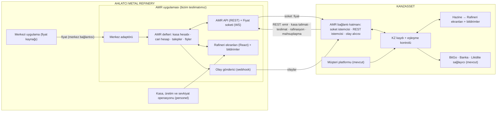
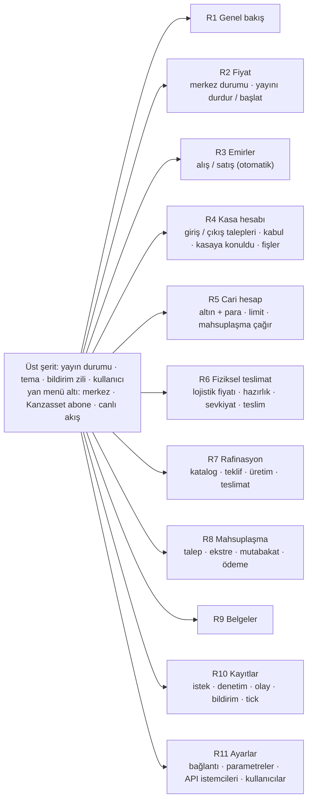
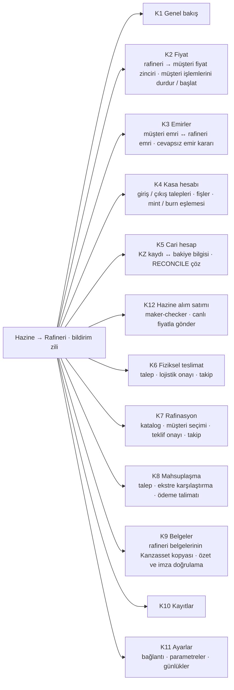
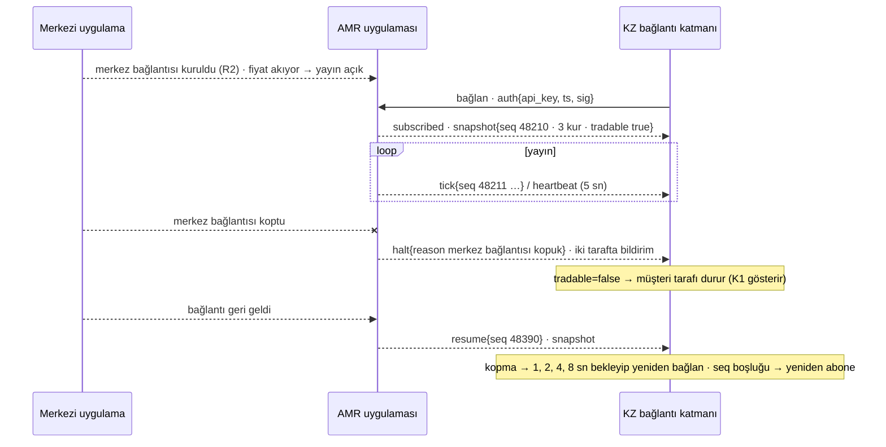
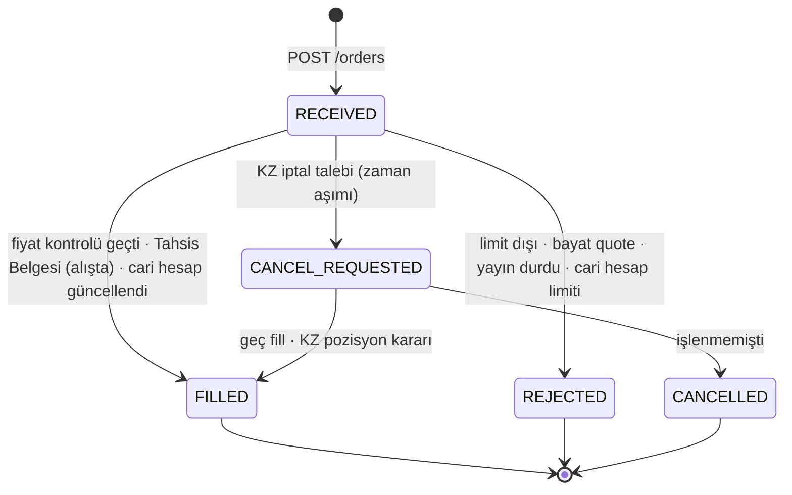
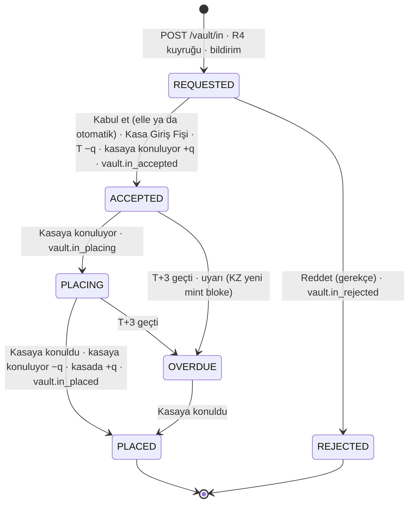
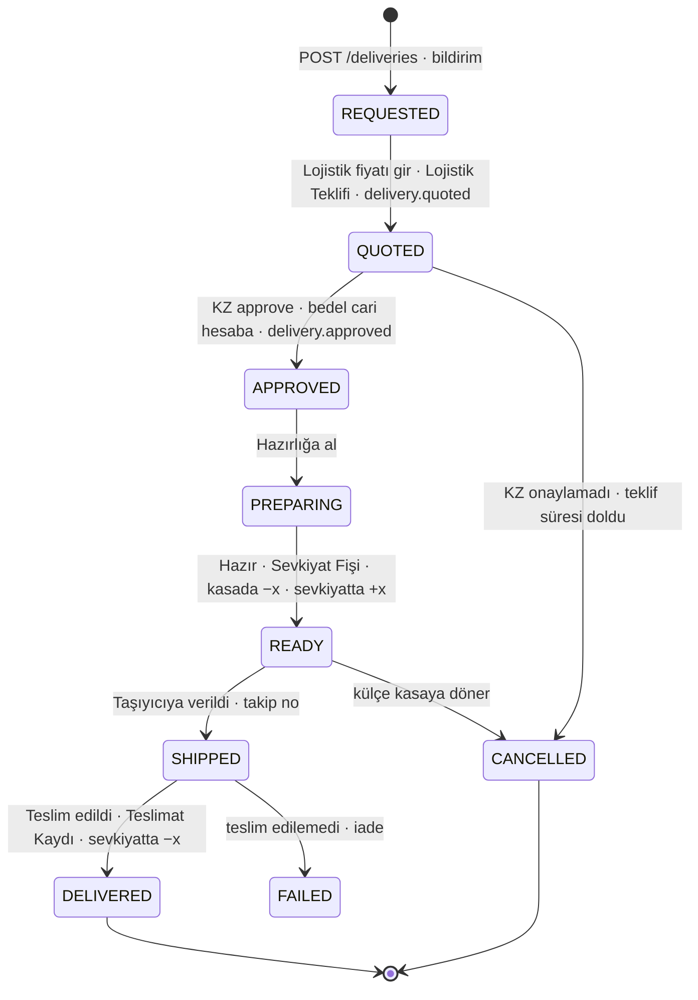
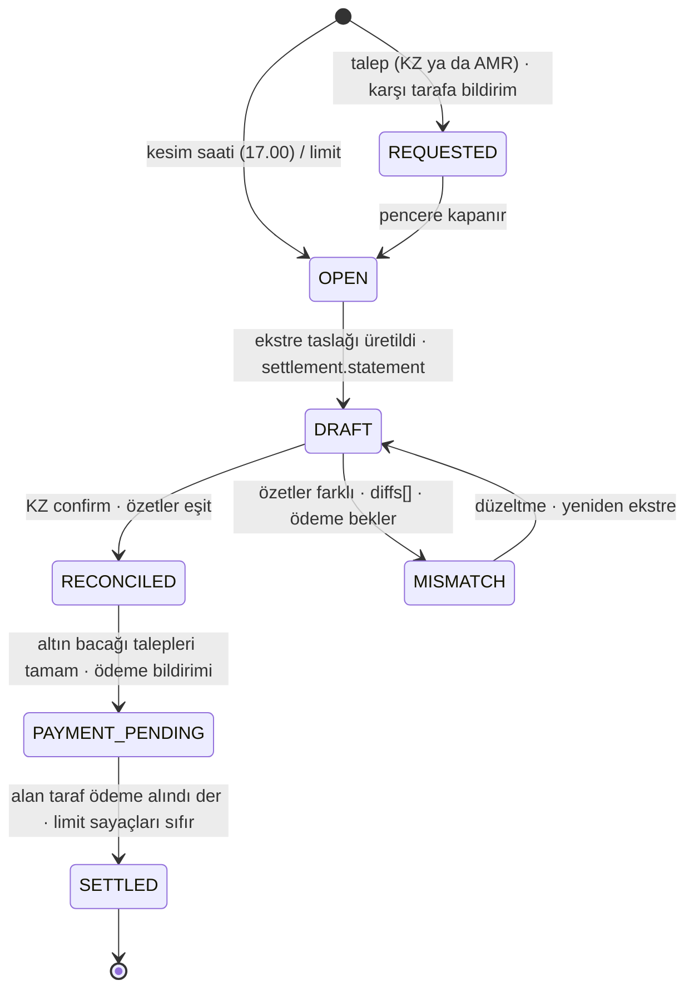

# Kanzasset ↔ AMR · Sistem

**21 Eylül 2026 · v2** · Bu doküman **neyi inşa edeceğimizi** tarif eder: rafineri tarafında çalışacak **AMR uygulaması** (rafineri personelinin ekranları + Kanzasset'e API ve fiyat soketi + rafinerinin merkezi uygulamasına bağlanan adaptör) ve Kanzasset tarafında mevcut platforma eklenecek ekranlar ve bağlantı katmanı. Akışların nasıl çalıştığı `KZ-AMR_Akislar` dokümanındadır; buradaki numaralar (03, 05, 12 gibi) o dokümanın akışlarına atıftır.

**Ne teslim ediyoruz:**

- **Rafineri uygulaması (AMR uygulaması):** React ekranlar (kasa operasyonu, masa, yönetici) · REST API + WebSocket fiyat soketi · kendi defteri (kasa hesabı, cari hesap, fişler) · merkez adaptörü (fiyat kaynağı) · olay gönderici (webhook) · bildirimler. Konteyner olarak teslim edilir; rafineri kendi ortamında çalıştırır.
- **Kanzasset tarafı ekler:** AMR bağlantı katmanı (soket istemcisi, REST istemcisi, olay alıcısı) · KZ kaydı (rafineri hesaplarının Kanzasset'teki karşılığı) ve eşleşme kontrolü · Hazine → Rafineri backoffice modülü · bildirimler. Mevcut müşteri platformu, BitGo ve banka entegrasyonları değişmez.
- **Ortak sözleşme:** tek OpenAPI dosyası ve soket mesaj şeması; iki taraf da bundan üretilen tiplerle çalışır. İlk günden **mock merkez** (fiyat simülatörü) ve **KZ simülatörü** ile uçtan uca demo koşulur; rafineri hazır olmadan sistem gösterilebilir.

**İlkeler:** ortak veritabanı yok, iki defter, mahsuplaşmada karşılaştırma · tüm miktarlar tam sayı (mg ve cent) · her metal hareketi bakiye bilgisi döner · her talep tipinin durumları vardır, her durum değişikliği iki tarafta bildirim üretir · her elle aksiyon denetim günlüğüne yazılır · rafineri tarafında mint, burn, token, cüzdan, müşteri adı yoktur; yalnız gram, fiş, fiyat, para ve "Kanzasset FZCO".

---

## 01 · Bileşenler ve mimari

AMR uygulaması rafineri tarafında bağımsız bir servistir: kendi veritabanı, kendi ekranları, Kanzasset'e açık API ve soket. Rafinerinin merkezi uygulamasıyla yalnız **merkez adaptörü** konuşur (fiyat girişi); merkez bağlantısı R2'den kurulur, fiyat akmaya başlayınca sistem yayına geçer. Defter, API ve ekranlar adaptörü bilmez. Kanzasset tarafında **AMR bağlantı katmanı** rafineriyle konuşan tek yerdir.

<!-- cap: Bileşenler ve kanallar -->

**Kanallar:** (1) **Fiyat soketi** AMR → KZ, tek yön, kalıcı bağlantı (04). (2) **REST API** KZ → AMR: emirler, kasa talimatları, fiziksel teslimat, rafinasyon, mahsuplaşma, sorgular (05). (3) **Olaylar** AMR → KZ: her durum değişikliği webhook ile, imzalı ve tekrar denemeli (06); iki taraftaki bildirimler bu olaylardan üretilir. Üçü de aynı sözleşmeden üretilir.

---

## 02 · Rafineri uygulaması: ekranlar ve aksiyonlar

On bir ekran, dört rol. Menü Kanzasset paneliyle aynı sırada ve aynı adlarladır (simge + ad; R kodları yalnız sayfa başlığında). Her ekranda sabit **üst şerit** sadedir: yayın durumu (yayında / durdu) · tema · **bildirim zili** (bekleyen talepler, mahsuplaşma talebi, uyarılar) · kullanıcı. Bağlantı ve kontrol durumları (merkez bağlı mı, Kanzasset abone mi, canlı akış) yan menünün altındaki durum satırlarındadır; kasa hesabı, cari hesap ve limit Genel bakış ile ilgili ekranlardadır.

<!-- cap: Ekran haritası · rafineri -->

| Ekran | Amaç | Gösterir | Aksiyonlar (elle) | Otomatik olan | Rol |
|---|---|---|---|---|---|
| **R1 Genel bakış** | Günün durumu tek bakışta | bugünkü emirler (adet, gram, alış / satış) · gün içi cari hesap grafiği (altın ve para) · limit kullanımı · bekleyen işler (kasa talepleri, teslimat ve rafinasyon adımları, mahsuplaşma) · son bildirimler | yok, gezinme | tümü | hepsi |
| **R2 Fiyat** (01) | Yayını yönetmek | merkez bağlantısı durumu (bağlı / kopuk, son fiyat zamanı; adres ve bağlan / kes R11 Ayarlar'da) · yayın durumu (`tradable`) · son 50 tick (seq, ts, üç kur bid / ask) · abone istemci (KZ bağlı mı, son heartbeat) | **Bağlan / Kes** (merkez) · **Yayını durdur / başlat** (gerekçe zorunlu; `price.halt` / `price.resume` olayı) | merkez fiyatı geldikçe tick yayını · heartbeat · merkez kesintisinde `tradable=false` ve bildirim | Masa, Yönetici |
| **R3 Emirler** (03, 04, 07, 08, 09) | KZ'den gelen alış / satış emirlerini izlemek | özet kartları (bugün: adet, gerçekleşen alış / satış, red; listedeki alış ve satış gramı) · liste (20'şer sayfa): zaman · müşteri emri no · yön · gram · kur · fiyat sırası · limit · sonuç (FILLED / REJECTED / CANCELLED) · fill fiyatı ve tutar · Tahsis Belgesi bağlantısı; filtre: gün, yön, durum; detay: red sebebi, o andaki bakiye bilgisi | yok | emri al · fiyatı `quote_seq` ve limitle karşılaştır · fill ya da red · Tahsis Belgesi üret (alışta) · cari hesabı güncelle · bakiye bilgisiyle cevapla · olay gönder · iptal talebine kesin cevap | Masa (okur), Denetçi |
| **R4 Kasa hesabı** (05, 06) | Kasa giriş / çıkış taleplerini işlemek ve kasa hesabını görmek | kasa hesabı alt kalemleri · **bekleyen talepler** (giriş / çıkış: gram, KZ ref, geliş zamanı, hedef cevap süresi sayacı) · işlenen talepler ve fişleri · "kasaya konuluyor" kuyruğu ve T+3 sayacı · günlük kasa ekstresi | **Kabul et / Reddet** (giriş ve çıkış; kabulde fiş oluşur ve KZ'ye gider) · giriş için **Kasaya konuluyor** → **Kasaya konuldu** durumları · fişleri ve ekstreyi görüntüle / indir | otomatik kabul (ayarlardan açılırsa) · kural kontrolleri: giriş için cari hesap altını yeterli, çıkış için kasada yeterli · fiş üretimi ve gönderimi · günlük ekstre (kesimde) · T+3 aşımında uyarı | Kasa operasyonu |
| **R5 Cari hesap** (02, 12) | Gün içi karşılıklı alacak borcu izlemek | **altın**: `T` hareketleri (fill'ler, kasa giriş / çıkış aktarımları) ve bakiye · **para**: kur bazında kalemler (alış satış bedelleri, lojistik, rafinasyon) ve net · limit göstergeleri (gram ve kur bazında para) · limit yaklaşırken uyarı | **Mahsuplaşma çağır** (gerekçe: talep ya da limit; KZ'ye bildirim) | hareketlerin işlenmesi · limit uyarısı · limitte yeni emir reddi | Masa |
| **R6 Fiziksel teslimat** (10) | Ücretsiz külçe teslimatını adım adım yürütmek | talepler ve durumları · detay: gram, standart külçe, adres referansı, lojistik teklifi, taşıyıcı ve takip no, teslimat kaydı | **Lojistik fiyatı gir** (taşıyıcıdan alınan fiyat, geçerlilik) → KZ onayı beklenir · **Hazırlığa al** · **Hazır** (Sevkiyat Fişi kesilir: kasada −x, sevkiyatta +x) · **Taşıyıcıya verildi** (taşıyıcı, takip no) · **Teslim edildi** (teslimat kaydı) · **İptal** (külçe kasaya döner) | her adımda `delivery.*` olayı ve bildirim · onaylanan lojistik bedeli cari hesaba kalem | Kasa operasyonu |
| **R7 Rafinasyon** (11) | Ürün kataloğunu tutmak, rafinasyon taleplerini yürütmek | **Katalog**: ürün · gramaj · ayar · tarife · üretim süresi · aktif / pasif · **Talepler**: kalemler × adet, adres referansı, teklif, üretim ve teslimat durumu | Katalog: **ürün ekle / düzenle / pasife al** (KZ'ye `catalog.updated`) · Talep: **Teklif ver** (ürün bedeli + lojistik, geçerlilik) → KZ onayı beklenir · **Üretime al** · **Hazır** (Sevkiyat Fişi) · **Taşıyıcıya verildi** (takip no) · **Teslim edildi** · **İptal** (üretime kadar) | her adımda `refining.*` olayı ve bildirim · onaylanan bedel cari hesaba kalem | Üretim, Kasa operasyonu |
| **R8 Mahsuplaşma** (12) | Pencereyi kapatmak, ekstreleri karşılaştırmak, ödemeyi kapatmak | pencereler (tarih, tetik: kesim / KZ talebi / AMR talebi / limit, durum) · **gelen talep bildirimi** · ekstre taslağı (işlemler, `T` net, kur bazında para, hizmet bedelleri) · KZ ekstresiyle **karşılaştırma sonucu** (eşit / fark satırları) · altın bacağı (KZ'den gelen giriş / çıkış talepleri) · para bacağı (ödeyen taraf, banka bilgileri) | **Mahsuplaşma talep et** · **Ekstreyi onayla** (mutabakat) · **Ödeme bildir** (AMR ödeyen ise banka referansı) · **Ödeme alındı** (KZ ödeyen ise) | kesim saatinde pencere · ekstre taslağı · karşılaştırma · `SETTLED` kapanışı ve limit sayaçlarının sıfırlanması | Masa, Yönetici |
| **R9 Belgeler** | Tüm fiş ve belgelerin arşivi | Tahsis Belgesi · Kasa Giriş / Çıkış Fişi · Lojistik ve Rafinasyon Teklifi · Sevkiyat Fişi · Teslimat Kaydı · faturalar · ekstreler; her biri için oluşturma ve **KZ'ye gönderim zamanı**, teslim durumu; arama (tip, tarih, referans); imza doğrulama | görüntüle · indir · yeniden gönder | üretim, imzalama, gönderim | hepsi (Denetçi salt okunur) |
| **R10 Kayıtlar** | Denetim ve kanıt tek ekranda | istek günlüğü (Kanzasset istekleri ve panel değişiklikleri; gövde yerine sha256) · denetim günlüğü · olay teslimleri · bildirimler · fiyat tick'leri; aynı dört sütun (zaman · kim · ne · sonuç), metin süzgeci, 20'şer sayfa | yok | yazım ve saklama süresi (90 gün) | hepsi |
| **R11 Ayarlar** | Bağlantı, parametreler ve erişim | **merkez bağlantısı** (soket adresi, bağlan / kes, yeniden bağlanma kuralı) · parametreler (kasa talimatı kabulü elle / otomatik ve hedef cevap süresi · kasaya koyma vadesi T+3 · cari hesap limitleri · kesim saati · teklif geçerlilik süreleri · kur bazında banka hesapları) · API istemcileri (KZ anahtarı, imza sırrı, olay adresi) · kullanıcılar ve roller · **denetim günlüğü** | parametre değiştir (ikinci onay) · istemci anahtarı üret / iptal et · kullanıcı ekle / rol ver | her elle aksiyonun günlüğe yazılması | Yönetici |

**Bildirimler (zil):** bekleyen kasa talebi · hedef cevap süresi aşıldı · kasaya koyma T+3 yaklaştı · teslimat ve rafinasyon adımı bekliyor · KZ onayı geldi · mahsuplaşma talebi geldi · limit yaklaştı / aşıldı · merkez bağlantısı koptu · KZ soketi koptu · eşleşme uyuşmazlığı. Her bildirim ilgili ekrana götürür; okundu / işlendi izi tutulur.

**Elle yapılan işler azdır ve fiziksel dünyaya bağlıdır:** kasa talebini kabul etmek ve kasaya koymayı işlemek, lojistik fiyatı ve rafinasyon teklifi girmek, hazırlık, sevkiyat ve teslim adımları, mahsuplaşmada onay ve ödeme, yayını durdurmak. Emir, fill, fiş, bakiye ve olayların hepsi otomatiktir.

---

## 03 · Kanzasset tarafı: ekranlar

Mevcut backoffice'e **Hazine → Rafineri** modülü olarak eklenir. Müşteri ekranları (fiyat gösterimi, emir fişi, fiziksel teslimat ve rafinasyon seçimi) değişmez; bu ekranlar rafineriyle ilişkiyi yönetir. Menü rafineri paneliyle aynı sırada ve aynı adlarladır (simge + ad; K kodları yalnız sayfa başlığında); Kanzasset'e özgü tek ekran Hazine alım satımı'dır. Üst şerit ve yan menü altı rafineri tarafıyla aynı düzendedir (müşteri işlemleri durumu · tema · bildirim zili · kullanıcı; altta rafineri soketi · eşleşme ve kontroller · canlı akış).

<!-- cap: Ekran haritası · Kanzasset (Hazine → Rafineri modülü) -->

| Ekran | Amaç | Gösterir | Aksiyonlar (elle) | Otomatik olan |
|---|---|---|---|---|
| **K1 Genel bakış** | Günün durumu tek bakışta | müşteri işlemleri durumu · rafineri ve müşteri fiyatı · iki hesabın KZ kaydı ve eşleşme · bugünkü emirler · bekleyen işler (cevapsız, geç fill, onay, teslim) · mahsuplaşma adımı · belge sayısı · kontroller | yok, gezinme | tümü |
| **K2 Fiyat** (01) | Rafineri fiyatının ve müşteri fiyatının sağlığı | soket durumu (ayarlar K11'de) · fiyat zinciri (rafineri alış / satış → müşteri satar / alır, marj, komisyon) · son 50 tick · müşteri işlemlerinin durumu (açık / durdu ve sebebi) | **Müşteri işlemlerini durdur / başlat** (gerekçeli) | bayat fiyat ya da `tradable=false` → müşteri tarafı otomatik durur · yeniden bağlanma · `seq` boşluğunda yeniden abonelik |
| **K5 Cari hesap** (02) | KZ kaydı ile rafineri bakiye bilgisinin eşleşmesi | kasa hesabı alt kalemleri · cari hesap (altın, kur bazında para) · **eşleşme durumu** (EŞİT / RECONCILE) · fark satırları · `seq` | **Anlık fotoğraf iste** · **RECONCILE çöz** (fark açıklaması + düzeltme kaydı, maker-checker) | her harekette karşılaştırma · uyuşmazlıkta mint ve kasa çıkışı blokesi |
| **K3 Emirler** (03, 04, 07, 08) | Müşteri emri ile rafineri emrinin eşlemesi | özet kartları (bugün, listedeki alış / satış gramı) · süzgeçli ve 20'şer sayfalı liste · müşteri emri ↔ rafineri emri (müşteri emri no) · durumlar · fill fiyatı ve müşteri fiyatı · **cevapsız emir kuyruğu** (sorgu / iptal sonucu) · geç fill pozisyonları | **Geç fill kararı**: ters emirle kapat ya da toleransta taşı | emir gönderimi · zaman sınırı · durum sorgusu · iptal talebi |
| **K4 Kasa hesabı** (05, 06) | Giriş / çıkış talepleri, fişler ve mint / burn eşlemesi | talep listesi ve durumları (talep · kabul · kasaya konuluyor · kasaya konuldu · red) · Kasa Giriş / Çıkış Fişleri · BitGo mint / burn işlem referansı · T+3 sayacı · `kasaya konuluyor` tavanı göstergesi | yalnız yönetici: **elle giriş / çıkış talebi** (gerekçeli, ikinci onay) | 07, 09, 12'de otomatik giriş talebi · 08, 09, 12'de otomatik çıkış talebi · fiş gelince mint, burn sonra çıkış talebi |
| **K12 Hazine alım satımı** (09) | Envanter hedefini değiştirmek | talepler · onay matrisi durumu · canlı fiyat ve tutar · sonuç zinciri (fill → kasa girişi / çıkışı → mint / burn) | **Talep oluştur** (maker) · **Onayla** · **Son onaycı: canlı fiyatla gönder** | zincirin geri kalanı |
| **K6 Fiziksel teslimat** (10) | Müşteri itfa taleplerinin rafineriye iletimi ve takibi | müşteri talebi ↔ rafineri talebi · lojistik teklifi · durum (`delivery.*`) · emanet tokenler (`E`) · burn anı | **Talebi gönder** · **Lojistik teklifini onayla** (müşteri onayından sonra) · **İptal** (sevkiyattan önce) | onayda lojistik bedeli cari hesaba · `DELIVERED` olayında burn · müşteriye durum yansıması |
| **K7 Rafinasyon** (11) | Katalogdan müşteri seçimi, teklif onayı, takip | güncel katalog (rafineriden) · müşteri seçimleri · rafineri teklifi (ürün bedeli + lojistik) · müşteriye gösterilen fiyat (marj + komisyon dahil) · durum (`refining.*`) · emanet tokenler | **Talebi gönder** · **Teklifi onayla** (müşteri onayından sonra) · **İptal** (üretime kadar) | katalog güncellemesi (`catalog.updated`) · onayda bedel cari hesaba · `DELIVERED` olayında burn |
| **K8 Mahsuplaşma** (12) | Pencereyi kapatmak ve ödemeyi yapmak | pencereler · **gelen talep bildirimi** · KZ ekstresi ↔ AMR ekstresi karşılaştırma · altın bacağı (giriş / çıkış + mint / burn) izleme · para bacağı: kur bazında net, yön, banka talimatı | **Mahsuplaşma talep et** · **Mutabakat onayı** · **Ödeme talimatı** (şirket hesabından, ikinci onay) ve **ödeme bildirimi** · **Ödeme alındı** onayı | kesimde pencere · ekstre · karşılaştırma · altın bacağı talepleri |
| **K9 Belgeler** | Rafineri belgelerinin Kanzasset kopyası | olayla gelen her belge numarası çekilir, sha256 özeti yeniden hesaplanır (hash_ok), anahtar verilmişse imza doğrulanır (signature_ok), içerik saklanır · tip ve metin süzgeci · 20'şer sayfa · PDF (rafineriden imzalı istekle) | **Belgeleri eşitle** (geriye dönük tarama) · görüntüle · PDF | olayla çekme, doğrulama, özet tutmuyorsa bildirim |
| **K10 Kayıtlar** | Denetim ve kanıt tek ekranda | istek günlüğü · denetim günlüğü · olaylar · bildirimler · fiyat tick'leri; aynı dört sütun, metin süzgeci, 20'şer sayfa | yok | yazım ve saklama süresi |
| **K11 Ayarlar** | Bağlantı ve iş kurallarının değerleri | rafineri soketi ve REST adresi, durum, son mesaj, yeniden bağlanma (salt okunur; adres ortam değişkeni) · taban / tavan / hedef · mint politikası · tavan aşımında burn hedefi · slippage aralığı · emir zaman sınırı · bayatlık eşiği · cari hesap limitleri · pencere sayısı · burn anı · `kasaya konuluyor` tavanı · onay matrisi | değiştir (ikinci onay, günlüğe yazılır) | |

---

## 04 · Fiyat soketi

Tek yön, AMR → KZ. WebSocket, kalıcı bağlantı, JSON mesajlar. Fiyat gram başına, 999,9 ayar, üç kur, boyuttan bağımsız. Kaynak: R2'de kurulan merkez bağlantısı; merkez yoksa yayın yok.

**Bağlantı:** `wss://<amr>/v1/prices` · kimlik: ilk mesajda `{ "type": "auth", "api_key": "…", "ts": "…", "sig": "…" }` (HMAC) · başarısızsa sunucu bağlantıyı kapatır · başarılıysa `{ "type": "subscribed" }` ve hemen ardından **anlık fotoğraf**.

| Mesaj | Yön | Alanlar | Kural |
|---|---|---|---|
| `snapshot` | AMR → KZ | `seq` · `ts` · `tradable` · `prices[]{ccy, bid, ask}` | abonelikte ve `seq` boşluğu sonrası yeniden abonelikte |
| `tick` | AMR → KZ | aynı alanlar | yalnız fiyat değişince, saniyede en fazla ~1 |
| `heartbeat` | AMR → KZ | `seq` · `ts` · `tradable` | 5 sn tick yoksa |
| `halt` | AMR → KZ | `ts` · `reason` | yayın durdu (elle ya da merkez koptu): `tradable=false`; KZ müşteri tarafını durdurur |
| `resume` | AMR → KZ | `seq` · `ts` | yayın yeniden açıldı; ardından `snapshot` |
| `ping` / `pong` | iki yön | `ts` | bağlantı canlılığı (taşıma katmanı) |

**KZ tarafı kuralları:** 10 sn hiçbir mesaj yok → fiyat bayat → müşteri tarafı durur · `seq` atladı → yeniden abone ol, `snapshot` bekle · kopma → üstel bekleme ile yeniden bağlan (1, 2, 4, 8 sn, en fazla 30 sn) · her emirde kullanılan tick'in `seq` değeri `quote_seq` olarak gönderilir. Fiyatlar ondalık dize olarak taşınır (`"142.00"`), hesaplama tarafında cent / mg'ye çevrilir.

<!-- cap: Bağlantı, kesinti ve toparlanma -->

---

## 05 · REST API (KZ → AMR)

Taban adres `https://<amr>/v1`. Tüm istekler JSON. Kimlik ve bütünlük: `X-API-Key` · `X-Timestamp` · `X-Signature` (HMAC-SHA256: zaman damgası + yöntem + yol + gövde). Her `POST` için `Idempotency-Key`: aynı anahtarla tekrar gelen istek aynı cevabı alır, ikinci kez işlenmez. Miktarlar tam sayı: `*_mg`, `*_cents`. Zaman ISO 8601 UTC. Metal hareketi doğuran her cevapta `account` (bakiye bilgisi) vardır. Talepler yalnız gram, kalem ve Kanzasset referansı taşır; mint / burn alanı yoktur.

| Uç | Gövde (istek) | Cevap | Kurallar |
|---|---|---|---|
| `GET /session/status` | | `status: OPEN / HALTED / MAINTENANCE` · `tradable` · `source_connected` · `ts` | merkez bağlantısı ve yayın durumu |
| `POST /orders` (03, 04, 07, 08, 09) | `client_order_id` · `side: BUY / SELL` · `qty_mg` · `ccy` · `quote_seq` · `limit_px` · `tif: FOK` · `time_limit_ms` | `order_id` · `status: FILLED / REJECTED` · `fill{px, qty_mg, amount_cents, ccy, trade_ts}` · `reject_reason` · `allocation_certificate{doc_id, url}` (alışta) · `account` | tümü ya hiç (FOK) · fiyat `quote_seq` tick'i ve `limit_px` ile kontrol edilir · cari hesap limiti aşılacaksa red · `client_order_id` tekilse tekrar aynı cevap |
| `GET /orders/{id}` · `POST /orders/{id}/cancel` | | emir + durum geçmişi · `status: CANCELLED` ya da `FILLED` (geç fill) | kesin cevap; açık kalmaz |
| `POST /vault/in` (05) | `qty_mg` · `ref` | `request_id` · `status: REQUESTED` | kural: cari hesap altını ≥ `qty_mg`, değilse `INSUFFICIENT_CURRENT_ACCOUNT` · kabulde `vault.in_accepted` (Kasa Giriş Fişi + `account`), sonra `vault.in_placing`, `vault.in_placed`; vade geçerse `vault.in_overdue`; red: `vault.in_rejected{reason}` · `ref` tekildir: aynı ref ile gelen istek aynı talebi döner (çift mint koruması) |
| `POST /vault/out` (06) | `qty_mg` · `ref` | `request_id` · `status: REQUESTED` | kural: kasada ≥ `qty_mg` (kasaya konuluyor sayılmaz), değilse `INSUFFICIENT_VAULT` · kabulde `vault.out_accepted` (Kasa Çıkış Fişi + `account`); red: `vault.out_rejected{reason}` |
| `GET /vault/requests/{id}` | | talep durumu ve geçmişi, fiş referansı | `request_id` ya da KZ referansı ile |
| `GET /vault/statement?date=` | | günlük kasa ekstresi: açılış / kapanış alt kalemleri · hareketler · fiş referansları · imza | rezerv kanıtı (`V ≥ A`), Kontroller |
| `POST /deliveries` (10) | `qty_mg` · `address_ref` · `insured_party_ref` · `ref` | `delivery_id` · `status: REQUESTED` | kasada ≥ `qty_mg` · adres referansı KZ'de çözülür |
| `POST /deliveries/{id}/approve` · `POST /deliveries/{id}/cancel` · `GET /deliveries/{id}` | `quote_id` (onayda) | durum ve geçmiş | onay yalnız `QUOTED` iken ve teklif geçerliyken · iptal `SHIPPED` öncesi · onayla lojistik bedeli cari hesaba |
| `GET /catalog` (11) | | `items[]{item_id, name, weight_mg, fineness, unit_price_cents, ccy, lead_time_days, active}` · `version` | rafineri R7'de yönetir · değişince `catalog.updated` |
| `POST /refining` (11) | `items[]{item_id, qty}` · `address_ref` · `insured_party_ref` · `ref` | `refining_id` · `status: REQUESTED` · `total_mg` | kasada ≥ toplam saf gram |
| `POST /refining/{id}/approve` · `POST /refining/{id}/cancel` · `GET /refining/{id}` | `quote_id` (onayda) | durum ve geçmiş | onay yalnız `QUOTED` iken · iptal `IN_PRODUCTION` öncesi · onayla ürün bedeli + lojistik cari hesaba |
| `GET /account` (02) | | `seq` · `vault{in_vault_mg, placing_mg, shipping_mg}` · `current_account{gold_mg, money[]{ccy, cents}}` · `status: OK / RECONCILE / HALTED` | anlık fotoğraf |
| `GET /vault/statement?date=` | | alt kalemler · hareketler · fiş referansları · imza | günlük kasa ekstresi (rezerv kanıtı) |
| `GET /current-account/statement?window=` | | `trades[]` · `gold_mg` · `money[]` · `fees[]` · imza | mahsuplaşma adım 1 |
| `POST /settlements` (12) | `trigger: CUTOFF / REQUEST / LIMIT` | `settlement_id` · `status: OPEN / DRAFT` · `statement` | iki taraf da çağırabilir (AMR tarafı R8'den) · karşı tarafa `settlement.requested` · açık pencere varsa onu döner |
| `GET /settlements/{id}` | | ekstre · durum · `gold_leg{t_net_mg, requests[]}` · `money_leg[]{ccy, net_cents, direction}` | |
| `POST /settlements/{id}/confirm` | `statement_hash` (KZ ekstresinin özeti) | `status: RECONCILED` ya da `MISMATCH` + `diffs[]` | mutabakat adımı |
| `POST /settlements/{id}/payment-notice` · `POST /settlements/{id}/payment-received` | `ccy` · `amount_cents` · `direction` · `bank_ref` · `ts` | `status: PAYMENT_PENDING / SETTLED` | ödeyen bildirir, alan onaylar → `SETTLED` |
| `GET /documents/{id}` · `GET /documents/{id}/pdf` | | JSON içerik + `meta{type, related_id, hash, signature, created_ts, sent_ts}` · aynı belgenin A4 PDF hâli | tüm fiş ve belgeler tek uçtan; imza HMAC-SHA256 (bkz. `KARARLAR.md`) |

**Red sebepleri (`reject_reason`):** `PRICE_OUTSIDE_LIMIT` (slippage) · `STALE_QUOTE` (`quote_seq` eski) · `TRADING_HALTED` · `CURRENT_ACCOUNT_LIMIT` · `DUPLICATE_ORDER` · `INVALID_QTY` · `INSUFFICIENT_CURRENT_ACCOUNT` · `INSUFFICIENT_VAULT` · `QUOTE_EXPIRED` · `INTERNAL_ERROR` (KZ: işlemi durdur, elle bak).

---

## 06 · Olaylar (webhook, AMR → KZ) ve bildirimler

Her durum değişikliği KZ'nin olay adresine `POST` edilir. Zarf: `event_id` (tekil) · `type` · `ts` · `data` · `account` (metal hareketi varsa) · imza başlıkları (05 ile aynı). KZ `event_id` ile tekrarı ayıklar; cevap 2xx değilse AMR üstel bekleme ile yeniden dener (1 dk, 5 dk, 30 dk, 2 sa; 24 saat), R9'da teslim durumu görünür. Olaylar `seq` ile sıralıdır; KZ boşluk görürse `GET /account` ve ilgili kaynağı sorgular. **Bildirimler** iki tarafta bu olaylardan türetilir: rafineri tarafında bekleyen talepler ve KZ onayları, Kanzasset tarafında rafineri kararları ve adımları.

| Olay | Ne zaman | `data` |
|---|---|---|
| `order.filled` · `order.rejected` · `order.cancelled` | emir sonuçlanınca (cevapla aynı içerik; kopma durumunda güvence) | emir + fill / red sebebi |
| `vault.in_accepted` · `vault.in_placing` · `vault.in_placed` · `vault.in_overdue` · `vault.in_rejected` | kasa girişi talebi kabul / kasaya konuluyor / kasaya konuldu / kasaya koyma vadesi geçti (T+3) / red (R4) | `request_id` · `qty_mg` · `ref` · fiş `doc_id` · `due_ts` · zaman. `in_overdue` KZ tarafında yeni mint'i bloke eder (Kontroller) |
| `vault.out_accepted` · `vault.out_rejected` | kasa çıkışı talebi kabul / red (R4) | `request_id` · `qty_mg` · `ref` · fiş `doc_id` |
| `delivery.quoted` · `delivery.approved` · `delivery.preparing` · `delivery.ready` · `delivery.shipped` · `delivery.delivered` · `delivery.cancelled` · `delivery.failed` | R6 adımları | `delivery_id` · durum · teklif (tutar, kur, geçerlilik) · Sevkiyat Fişi · taşıyıcı · takip no · teslimat kaydı |
| `catalog.updated` | katalog değişince (R7) | `version` · değişen kalemler |
| `refining.quoted` · `refining.approved` · `refining.in_production` · `refining.ready` · `refining.shipped` · `refining.delivered` · `refining.cancelled` · `refining.failed` | R7 adımları | `refining_id` · durum · teklif (ürün bedeli, lojistik, süre, geçerlilik) · Sevkiyat Fişi · takip no · teslimat kaydı |
| `settlement.requested` · `settlement.opened` · `settlement.statement` · `settlement.reconciled` · `settlement.mismatch` · `settlement.payment_notice` · `settlement.settled` | 12 adımları; `requested` iki yönlü (AMR talep ederse KZ'ye, KZ talep ederse R8'e bildirim) | `settlement_id` · tetik · ekstre · farklar · ödeme bilgisi |
| `price.halt` · `price.resume` | yayın durdu / açıldı (R2 elle ya da merkez kesintisi) | `reason` · `ts` |
| `account.reconcile` | AMR tarafı uyuşmazlık tespit etti | `seq` · beklenen ve gelen değerler |

---

## 07 · Veri modeli (AMR defteri)

Tek veritabanı, tam sayı miktarlar, her satır zaman damgalı ve kim / ne ile ilişkili. Bakiye tabloları hareketlerden türetilebilir olmalıdır (yeniden hesaplama = kontrol). Mint, burn, token alanı yoktur.

| Tablo | Anahtar alanlar | Not |
|---|---|---|
| `orders` | `id` · `client_order_id` (tekil) · `side` · `qty_mg` · `ccy` · `quote_seq` · `limit_px` · `tif` · `time_limit_ms` · `status` · `reject_reason` · `fill_px` · `fill_amount_cents` · `trade_ts` | R3 |
| `current_account_movements` | `id` · `type: FILL_BUY / FILL_SELL / VAULT_IN / VAULT_OUT / FEE_DELIVERY / FEE_REFINING / SETTLEMENT_PAYMENT` · `gold_mg` (işaretli) · `ccy` · `amount_cents` (işaretli) · `ref` · `ts` | `T` ve `P` bu tablodan türer (R5) |
| `current_account_balance` | `gold_mg` · `money[]{ccy, cents}` · `seq` | anlık |
| `vault_requests` | `id` · `type: IN / OUT` · `qty_mg` · `ref` (KZ) · `status: REQUESTED / ACCEPTED / PLACING / PLACED / REJECTED` · `accepted_by` · `accepted_ts` · `placed_ts` · `due_ts` · `doc_id` · `reject_reason` | R4 kuyruğu |
| `vault_movements` | `id` · `type: IN_ACCEPTED / PLACED / OUT_ACCEPTED / SHIP_READY / SHIP_RETURN / DELIVERED` · `qty_mg` · `related_id` · `doc_id` · `ts` | `V` alt kalemleri bu tablodan türer |
| `vault_balance` | `in_vault_mg` · `placing_mg` · `shipping_mg` · `seq` | anlık |
| `deliveries` | `id` · `qty_mg` · `address_ref` · `insured_party_ref` · `ref` · `status` · `quote{amount_cents, ccy, carrier, valid_until}` · `carrier` · `tracking_no` · `shipping_doc_id` · `pod_doc_id` · geçmiş | R6 |
| `catalog_items` | `item_id` · `name` · `weight_mg` · `fineness` · `unit_price_cents` · `ccy` · `lead_time_days` · `active` · `version` | R7 katalog |
| `refining_requests` | `id` · `items[]{item_id, qty}` · `total_mg` · `address_ref` · `ref` · `status` · `quote{product_cents, logistics_cents, ccy, lead_time_days, valid_until}` · `tracking_no` · `shipping_doc_id` · `pod_doc_id` · geçmiş | R7 talepler |
| `settlements` | `id` · `trigger: CUTOFF / REQUEST_KZ / REQUEST_AMR / LIMIT` · `window_from` · `window_to` · `status` · `statement_hash` · `kz_statement_hash` · `gold_leg` · `money_leg[]` · `diffs[]` · `paid_ts` | R8 |
| `documents` | `id` · `type` · `related_id` · `pdf_path` · `hash` · `signature` · `created_ts` · `sent_ts` · `delivery_status` | R9; imza anahtarı rafinerinin |
| `notifications` | `id` · `type` · `related_id` · `for_role` · `created_ts` · `read_by` · `handled_ts` | zil |
| `price_ticks` | `seq` · `ts` · `prices` · `tradable` | 30 gün saklanır; R2 |
| `source_connection` · `api_clients` · `webhook_deliveries` | merkez soket adresi, kimlik, durum · KZ anahtarı, imza sırrı, olay adresi · `event_id` · `type` · `status` · `attempts` · `last_error` | R2, R10 |
| `users` · `roles` · `audit_log` · `settings` | kullanıcı, rol, her elle aksiyon (kim, ne zaman, ne, önce / sonra) · parametreler | R10 |

---

## 08 · Durum makineleri

<!-- cap: Emir -->

<!-- cap: Kasa talimatı · giriş (çıkış: REQUESTED → ACCEPTED ile biter) -->

<!-- cap: Fiziksel teslimat (rafinasyon aynı iskelet: QUOTED sonrası IN_PRODUCTION adımı eklenir) -->

<!-- cap: Mahsuplaşma penceresi -->

Hesap durumu: `OK` · `RECONCILE` (uyuşmazlık; KZ tarafında mint ve kasa çıkışı talebi bloke) · `HALTED` (yayın durdu ya da limit).

---

## 09 · Roller ve yetkiler

| Rol | Taraf | Görür | Yapar |
|---|---|---|---|
| **Kasa operasyonu** | Rafineri | R1, R4, R6, R7 (talepler), R9 | kasa talebini kabul et / reddet · kasaya konuluyor / konuldu · teslimat ve sevkiyat adımları |
| **Üretim** | Rafineri | R1, R7, R9 | katalog · rafinasyon teklifi · üretime al · hazır |
| **Masa** | Rafineri | hepsi (R11 hariç) | merkez bağlantısı · yayını durdur / başlat · lojistik fiyatı gir · mahsuplaşma talebi, ekstre onayı, ödeme bildirimi |
| **Yönetici** | Rafineri | hepsi | R11: parametreler, istemciler, kullanıcılar; kritik parametrede ikinci onay |
| **Denetçi** | Rafineri | hepsi, salt okunur | belge ve günlük indirme |
| **Hazineci (maker)** | Kanzasset | K1'den K12'ye | talep oluşturur (hazine alım satımı, teslimat ve rafinasyon onayı, ödeme talimatı) |
| **Onaycı** | Kanzasset | K1'den K12'ye | onay matrisi; son onaycı canlı fiyatla gönderir |
| **Operasyon** | Kanzasset | K1, K3, K6, K7, K8 | cevapsız emir kararı · RECONCILE inceleme · teslimat ve rafinasyon takibi |
| **Yönetici** | Kanzasset | hepsi | K11 ayarlar (ikinci onay) · elle kasa talimatı (gerekçeli) |

Kritik aksiyonlarda iki kişi: parametre değişikliği, elle kasa talimatı, ödeme talimatı, RECONCILE düzeltmesi. Her aksiyon denetim günlüğünde: kim, ne zaman, ne, önceki ve sonraki değer.

---

## 10 · Teknik yığın ve teslimat

| Katman | Seçim | Not |
|---|---|---|
| Rafineri ekranları | **React + TypeScript** (Vite) · tablo ve form bileşenleri · bildirim zili · Türkçe arayüz · sayılar 3 ondalık gram, 2 ondalık para | üst şerit ortak bileşen; ekranlar R1'den R11'e rotalar |
| AMR API ve soket | Node.js + TypeScript (Fastify, ws) · sözleşme TypeBox → OpenAPI · HMAC imza · idempotency | tek sözleşme dosyası iki tarafa tip üretir |
| AMR defteri | Postgres (geliştirmede SQLite) · hareket tabloları + türetilmiş bakiyeler · günlük yeniden hesaplama kontrolü | |
| Fiş ve belgeler | JSON içerik + sha256 + rafineri imzası, aynı içerikten A4 PDF · `GET /documents/{id}` ve `/pdf` · gönderim izi | imza doğrulama R9 ve K4'te; imza HMAC-SHA256, Ed25519 kuruluma bırakıldı |
| Merkez adaptörü | R2'den kurulan soket bağlantısı; ilk sürüm **mock merkez** (rastgele yürüyüş, kesinti komutu); rafinerinin gerçek arayüzü gelince adaptör değişir, gerisi değişmez | |
| KZ simülatörü | S0'dan S9'a senaryoları otomatik koşan istemci (açılış, stoktan alış / satış, büyük alış / satış, kasa talepleri, teslimat, rafinasyon, cevapsız emir, mahsuplaşma) | rafineri ekranlarını demo için doldurur |
| Kanzasset tarafı | mevcut yığın (Next.js / Supabase); AMR bağlantı katmanı ayrı modül; K1'den K12'ye backoffice sayfaları | |
| Ortamlar | geliştirme · UAT (Render) · rafineri kurulumu (konteyner) | UAT'ta iki taraf da simülatörlerle |
| Teslim paketi | çalışan konteyner · OpenAPI · bu doküman + Akışlar · rafineri personeli kullanım kılavuzu · demo senaryosu ve test raporu | yöneticiye teslim |

Mevcut prototipler (`amr-app`, `kz-treasury`) bu tasarıma çekilir: kasa hesabı + cari hesap defteri, `vault/in` ve `vault/out` talepleri (kabul akışı), teslimat ve rafinasyon uçları, mahsuplaşma iki yönlü talep, bildirimler; hedge yönlendirmesiyle ve mint / burn ile ilgili alanlar rafineri tarafından kalkar.

---

## 11 · Sıradaki adımlar

1. **Bu dokümanın onayı:** ekran listesi ve aksiyonlar (02, 03), API alanları (05), red sebepleri, olay listesi (06).
2. **Ekran tasarımı:** iki yol var. (a) Claude Design'da R1'den R11'e ekranları çizip sonra koda geçmek: estetik önce, daha uzun. (b) Doğrudan React'te basit bir tasarım sistemiyle çalışan ekranları yapmak, estetiği sonra iyileştirmek: daha hızlı, yöneticiye çalışan sistem gösterir. Öneri: (b), çünkü amaç sistemin nasıl çalıştığını göstermek.
3. **Sözleşme:** OpenAPI ve soket şeması bu dokümandan üretilir; iki taraf da aynı dosyadan tip alır.
4. **Mock merkez ve KZ simülatörü:** senaryolar uçtan uca; rafineri ekranları gerçek veriyle dolar.
5. **Yöneticiye teslim:** çalışan uygulama + bu iki doküman + kullanım kılavuzu; rafinerinin gerçek fiyat arayüzü netleşince yalnız merkez adaptörü değişir.
